# Builds: [[Base/Constructions/index|Index]]

Constructing facilities at the base is essential for long-term survival. These buildings provide resources, technological unlocks, and defense.

## 🏗️ All Facilities

| Facility | Requirements | Research Necessary? | Only from Production | Prerequisite | Description |
| :--- | :--- | :--- | :--- | :--- | :--- |
| 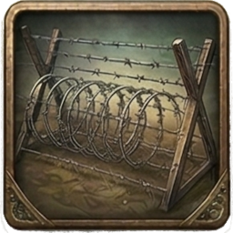&nbsp;[[Base/Constructions/barbed_wire|Barbed&nbsp;Wire&nbsp;Perimeter]] | 4x [[Items/Unknown/scrap_metal|Scrap Metal]] | No | - | Adds +6 town defense and reduces midnight attack strength by 8%. |
| 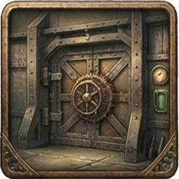&nbsp;[[Base/Constructions/reinforced_bulkhead|Reinforced&nbsp;Steel&nbsp;Bulkhead]] | 2x [[Items/Unknown/scrap_metal|Scrap Metal]] 6x [[Items/Unknown/stone|Hardened Stone]] | No | - | Adds +12 town defense. |
| &nbsp;[[Base/Constructions/watchtower|Watchtower]] | 4x [[Items/Unknown/timber|Raw Timber]] 4x [[Items/Unknown/stone|Hardened Stone]] | No | - | Adds +4 town defense. |
| 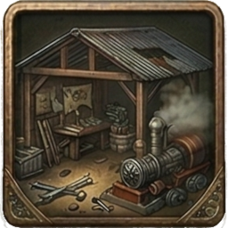&nbsp;[[Base/Constructions/scrap_workshop|Scrap&nbsp;Workshop]] | 4x [[Items/Unknown/scrap_metal|Scrap Metal]] 2x [[Items/Unknown/charred_planks|Charred Planks]] | No | - | Tier 1 build. Shortens search cooldown by 25% when searching at or next to the base. |
| &nbsp;[[Base/Constructions/assembly_bench|Assembly&nbsp;Bench]] | 4x [[Items/Unknown/scrap_metal|Scrap Metal]] 4x [[Items/Unknown/rusty_tool|Rusty Tool]] 2x [[Items/Unknown/timber|Raw Timber]] | No | - | Workbench for combining carried items using town recipes. Unlocks the Combine tab in town. |
| &nbsp;[[Base/Constructions/signal_booster|Signal&nbsp;Booster&nbsp;(Radar)]] | 2x [[Items/Unknown/scrap_metal|Scrap Metal]] 2x [[Items/Unknown/broken_radio|Broken Radio]] | No | - | Reduces unlit-tile search darkness penalty from 40% to 25%. |
| &nbsp;[[Base/Constructions/logistics_uplink|Logistics&nbsp;Uplink]] | 4x [[Items/Unknown/timber|Raw Timber]] 4x [[Items/Unknown/circuit_boards|Circuit Boards]] 6x [[Items/Unknown/copper_wiring|Copper Wiring]] 4x [[Items/Unknown/scrap_metal|Scrap Metal]] | No | - | Town logistics relay. Unlocks installing fabrication hauler drones at Industrial, Electronic Lab, and Farm facilities (Drone Operator Lv 3). Haulers move that facility's nightly fabricated output into town storage. |
| 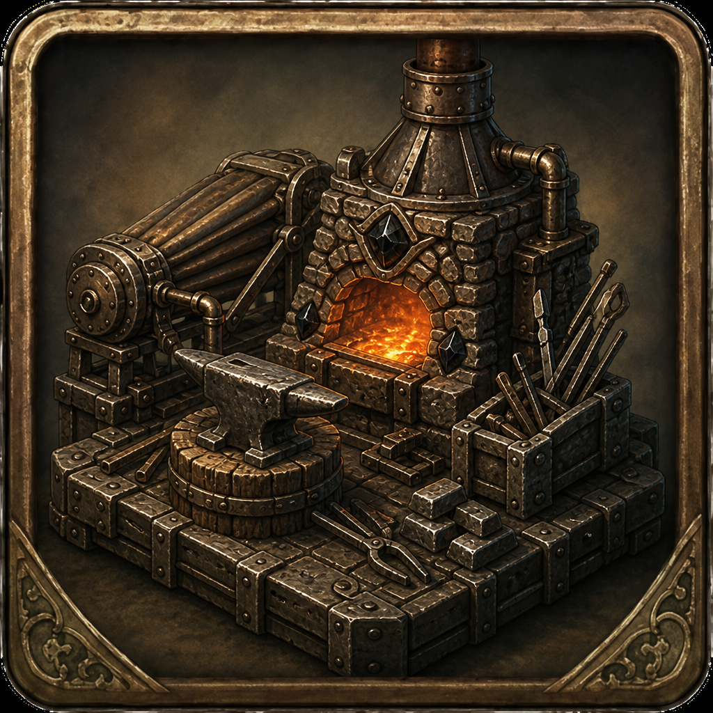&nbsp;[[Base/Constructions/forge|Forge]] | 8x [[Items/Unknown/stone|Hardened Stone]] 6x [[Items/Unknown/timber|Raw Timber]] 4x [[Items/Unknown/obsidian_flake|Obsidian Flake]] | No | - | Hot-work station for tempering scrap into fortified rebar. Unlocks the Forge Fortified Rebar recipe at town. |
| &nbsp;[[Base/Constructions/hydroponic_patch|Hydroponic&nbsp;Patch]] | 4x [[Items/Unknown/timber|Raw Timber]] 2x [[Items/Unknown/stone|Hardened Stone]] 2x [[Items/Unknown/scrap_metal|Scrap Metal]] | No | - | One-time when built: +3 rations on base ground and +10 salad in town storage. |
| &nbsp;[[Base/Constructions/preservation_rack|Preservation&nbsp;Rack]] | 4x [[Items/Unknown/timber|Raw Timber]] 6x [[Items/Unknown/salt_crystals|Salt Crystals]] | No | - | Salt-curing racks built beside the hydroponic patch. Once built, food consumables restore +1 additional AP. |
| 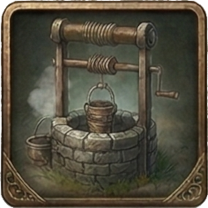&nbsp;[[Base/Constructions/well|Well]] | 4x [[Items/Unknown/timber|Raw Timber]] 6x [[Items/Unknown/stone|Hardened Stone]] | No | - | One-time when built: +10 water in town storage. |
| &nbsp;[[Base/Constructions/sentry_turret|Automated&nbsp;Sentry]] | 4x [[Items/Unknown/scrap_metal|Scrap Metal]] 2x [[Items/Unknown/burnt_motor|Burnt-Out Motor]] | No | - | Adds +10 town defense. |
| 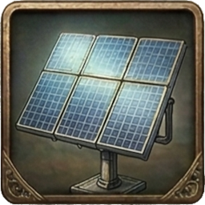&nbsp;[[Base/Constructions/solar_panels|Solar&nbsp;Panels]] | 4x [[Items/Unknown/solar_cell|Solar Cell]] 2x [[Items/Unknown/circuit_boards|Circuit Boards]] 4x [[Items/Unknown/copper_wiring|Copper Wiring]] 2x [[Items/Unknown/scrap_metal|Scrap Metal]] | Yes | - | Reduces daily base power drain by 10%. |
| &nbsp;[[Base/Constructions/research_lab|Research&nbsp;Lab]] | 8x [[Items/Unknown/scrap_metal|Scrap Metal]] | Yes | - | Enables two simultaneous research projects and lets the town process Research Material. |
| &nbsp;[[Base/Constructions/specimen_analysis_bay|Specimen&nbsp;Analysis&nbsp;Bay]] | 16x [[Items/Unknown/scrap_metal|Scrap Metal]] 4x [[Items/Unknown/circuit_boards|Circuit Boards]] 4x [[Items/Unknown/copper_wiring|Copper Wiring]] 4x [[Items/Monster_Parts/monster_chitin_uncommon|Uncommon Monster Chitin]] 6x [[Items/Monster_Parts/monster_bone_common|Common Monster Bone]] 4x [[Items/Monster_Parts/monster_gland_common|Common Monster Gland]] | No | Uncommon Monster Chitin Common Monster Bone Common Monster Gland | Catalogs threat specimens for High Command analysis. Unlocks the Donate tab for specimen crate exchanges. |
| &nbsp;[[Base/Constructions/research_lab_ii|Research&nbsp;Lab&nbsp;II]] | 120x [[Items/Unknown/scrap_metal|Scrap Metal]] | Yes | - | Expands the lab to four research slots and increases research speed by 20%. |
| 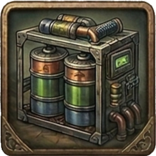&nbsp;[[Base/Constructions/battery_bank|Battery&nbsp;Storage]] | 6x [[Items/Unknown/car_battery|Car Battery]] 8x [[Items/Unknown/ceramic_shards|Ceramic Shards]] 4x [[Items/Unknown/scrap_metal|Scrap Metal]] | Yes | - | Increases maximum town power capacity by +20% permanently and allows batteries to refuel town power. |
| &nbsp;[[Base/Constructions/beacon_amplifier|Beacon&nbsp;Amplifier]] | 6x [[Items/Unknown/circuit_boards|Circuit Boards]] 6x [[Items/Unknown/copper_wiring|Copper Wiring]] 4x [[Items/Unknown/scrap_metal|Scrap Metal]] | Yes | - | Further reduces unlit search penalties (darkness -10, fear penalty per point 8 -> 6). |
| &nbsp;[[Base/Constructions/threat_scanner|Threat&nbsp;Scanner&nbsp;Beacon]] | 4x [[Items/Unknown/scrap_metal|Scrap Metal]] 2x [[Items/Unknown/circuit_boards|Circuit Boards]] 4x [[Items/Unknown/copper_wiring|Copper Wiring]] 2x [[Items/Unknown/pressure_valve|Pressure Valve]] | No | - | When built: reveals and highlights the closest tile with monsters on it. |
| 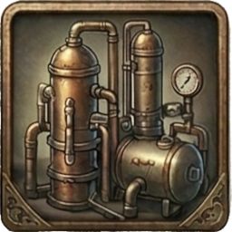&nbsp;[[Base/Constructions/fuel_refinery|Fuel&nbsp;Refinery]] | 6x [[Items/Unknown/chemical_sludge|Chemical Sludge]] 6x [[Items/Unknown/scrap_metal|Scrap Metal]] 4x [[Items/Unknown/stone|Hardened Stone]] 2x [[Items/Unknown/pressure_valve|Pressure Valve]] | Yes | - | At midnight converts up to 6 chemical sludge into up to 3 gasoline canisters (2:1). |
| 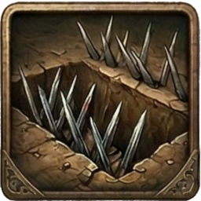&nbsp;[[Base/Constructions/spike_trench|Spike&nbsp;Trench]] | 6x [[Items/Unknown/timber|Raw Timber]] 4x [[Items/Unknown/stone|Hardened Stone]] 4x [[Items/Unknown/fortified_rebar|Fortified Rebar]] | No | - | Adds +3 town defense and -4 midnight attack strength. |
| 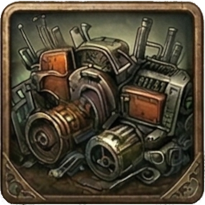&nbsp;[[Base/Constructions/scrap_barricade|Scrap&nbsp;Barricade&nbsp;Wall]] | 8x [[Items/Unknown/scrap_metal|Scrap Metal]] 6x [[Items/Unknown/quarry_bolts|Quarry Bolts]] 2x [[Items/Unknown/resin_sealant|Resin Sealant]] | No | Resin Sealant | Adds +5 town defense and -6 midnight attack strength. |
| &nbsp;[[Base/Constructions/palisade_wall|Timber&nbsp;Palisade&nbsp;Wall]] | 12x [[Items/Unknown/timber|Raw Timber]] 8x [[Items/Unknown/stone|Hardened Stone]] 6x [[Items/Unknown/fortified_rebar|Fortified Rebar]] 4x [[Items/Unknown/resin_sealant|Resin Sealant]] | No | Resin Sealant | Adds +7 town defense and -10 midnight attack strength. |
| &nbsp;[[Base/Constructions/kill_zone_lights|Kill-Zone&nbsp;Floodlights]] | 4x [[Items/Unknown/battery|Battery]] 6x [[Items/Unknown/copper_wiring|Copper Wiring]] 4x [[Items/Unknown/quarry_bolts|Quarry Bolts]] 2x [[Items/Unknown/signal_emitter|Signal Emitter]] | No | Signal Emitter | Adds +9 town defense, -5% midnight attack strength, and +10% stepped-loot/pole protection chance. |
| 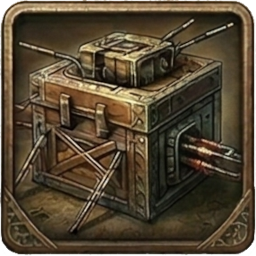&nbsp;[[Base/Constructions/auto_bolt_nest|Auto-Bolt&nbsp;Nest]] | 4x [[Items/Unknown/alloy_plate|Alloy Plate]] 4x [[Items/Unknown/targeting_relay|Targeting Relay]] 2x [[Items/Unknown/hardened_actuator|Hardened Actuator]] 6x [[Items/Unknown/scrap_metal|Scrap Metal]] | No | Alloy Plate Targeting Relay Hardened Actuator | Adds +12 town defense, -7% midnight attack strength, and +10% stepped-loot/pole protection chance. |
| 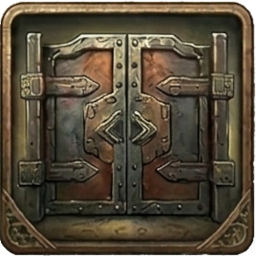&nbsp;[[Base/Constructions/armor_plated_gate|Armor-Plated&nbsp;Gate]] | 10x [[Items/Unknown/alloy_plate|Alloy Plate]] 6x [[Items/Unknown/ceramic_armor_tile|Ceramic Armor Tile]] 4x [[Items/Unknown/ballistic_mesh|Ballistic Mesh]] 4x [[Items/Unknown/hardened_actuator|Hardened Actuator]] 4x [[Items/Unknown/hydraulic_piston|Hydraulic Piston]] | No | Alloy Plate Hardened Actuator Hydraulic Piston | Adds +18 town defense and -12 midnight attack strength. |
| 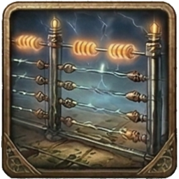&nbsp;[[Base/Constructions/shock_fence_grid|Shock&nbsp;Fence&nbsp;Grid]] | 12x [[Items/Unknown/copper_wiring|Copper Wiring]] 4x [[Items/Unknown/shock_capacitor|Shock Capacitor]] 2x [[Items/Unknown/threat_sensor_array|Threat Sensor Array]] 4x [[Items/Unknown/bio_spike_pod|Bio Spike Pod]] | No | Shock Capacitor Threat Sensor Array Bio Spike Pod | Adds +15 town defense, -8 flat midnight attack strength, and -5% remaining midnight attack strength. |
| 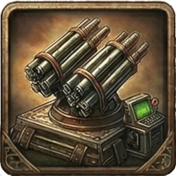&nbsp;[[Base/Constructions/sensor_jammer_grid|Sensor&nbsp;Jammer&nbsp;Grid]] | 4x [[Items/Unknown/logic_core|Logic Core]] 4x [[Items/Unknown/threat_sensor_array|Threat Sensor Array]] 4x [[Items/Unknown/targeting_relay|Targeting Relay]] 6x [[Items/Unknown/micro_fuse|Micro Fuse]] 4x [[Items/Unknown/ionized_filament|Ionized Filament]] | No | Logic Core Threat Sensor Array Targeting Relay | Adds +22 town defense and reduces future monster spawn-bonus growth by 15%. |
| 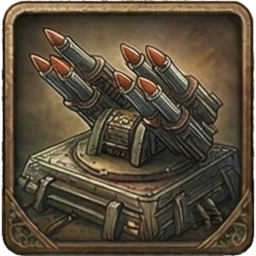&nbsp;[[Base/Constructions/counterbattery_array|Counterbattery&nbsp;Array]] | 6x [[Items/Unknown/signal_emitter|Signal Emitter]] 6x [[Items/Unknown/shock_capacitor|Shock Capacitor]] 4x [[Items/Unknown/hardened_actuator|Hardened Actuator]] 4x [[Items/Unknown/capacitor_bank|Capacitor Bank]] | No | Signal Emitter Shock Capacitor Hardened Actuator | Adds +26 town defense, -10% midnight attack strength, and reduces spawn-bonus growth by 15%. |
| 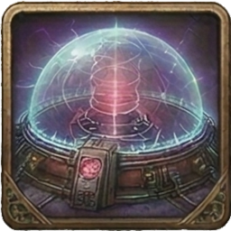&nbsp;[[Base/Constructions/citadel_aegis|Citadel&nbsp;Aegis&nbsp;Core]] | 6x [[Items/Unknown/threat_sensor_array|Threat Sensor Array]] 6x [[Items/Unknown/shock_capacitor|Shock Capacitor]] 6x [[Items/Unknown/targeting_relay|Targeting Relay]] 4x [[Items/Unknown/logic_core|Logic Core]] 2x [[Items/Unknown/ancient_relic|Ancient Relic]] | No | Threat Sensor Array Shock Capacitor Targeting Relay Logic Core | Adds +32 town defense, -10 flat and -10% midnight attack strength, +30% stepped-loot/pole protection, and -20% spawn-bonus growth. |
| 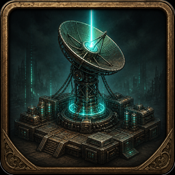&nbsp;[[Base/Constructions/extraction_beacon|Extraction&nbsp;Beacon]] | 6x [[Items/Unknown/beacon_component|Beacon Component]] 4x [[Items/Unknown/signal_emitter|Signal Emitter]] 4x [[Items/Unknown/logic_core|Logic Core]] 4x [[Items/Unknown/alloy_plate|Alloy Plate]] 2x [[Items/Unknown/vault_access_key|Vault Access Key]] | No | Signal Emitter Logic Core Alloy Plate Vault Access Key | Phase 2 apex build. Raises Command's extraction corridor. Hold power and defenses for three midnights after installation to complete Protocol Evac. |
