# Biome: [[Biomes/electronic_lab|Electronic Store / Lab]]

![[assets/tiles/electronics_01.png|250]]

**Description**: High-tech ruins filled with delicate components.

## Loot Tables (Absolute Success Probability (% per hour))
| Item | % Per Hour |
| :--- | :--- |
|  [[Items/circuit_boards|Circuit Boards]] | 17.8% |
| 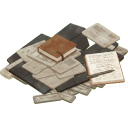 [[Items/research_material|Research Material]] | 16.6% |
| 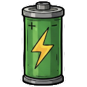 [[Items/battery|Battery]] | 14.3% |
| 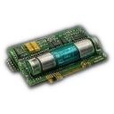 [[Items/micro_fuse|Micro Fuse]] | 10.9% |
|  [[Items/malfunctioning_sensor|Malfunctioning Sensor]] | 10.7% |
| 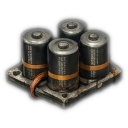 [[Items/capacitor_bank|Capacitor Bank]] | 10.0% |
|  [[Items/copper_wiring|Copper Wiring]] | 9.5% |
| 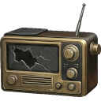 [[Items/broken_radio|Broken Radio]] | 8.3% |
|  [[Items/data_tape|Data Tape]] | 8.1% |
| 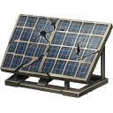 [[Items/damaged_solar_panel|Damaged Solar Panel]] | 7.1% |
| 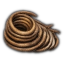 [[Items/thermal_coil|Thermal Coil]] | 7.1% |
| 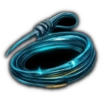 [[Items/ionized_filament|Ionized Filament]] | 6.7% |
| 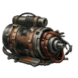 [[Items/burnt_motor|Burnt-Out Motor]] | 5.9% |
|  [[Items/cracked_lens|Cracked Lens]] | 5.9% |
| 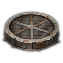 [[Items/filter_mesh|Filter Mesh]] | 5.7% |
| 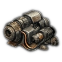 [[Items/fractured_servo|Fractured Servo]] | 5.7% |
|  [[Items/cryo_flask|Cryo Flask]] | 5.2% |
|  [[Items/gasoline_generator_empty|Gasoline Generator (empty)]] | 4.8% |
| 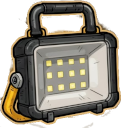 [[Items/lamp_empty|Lamp (empty)]] | 4.8% |
| 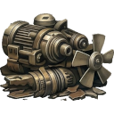 [[Items/ruined_generator_parts|Ruined Generator Parts]] | 4.8% |
| 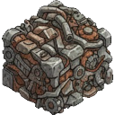 [[Items/scrap_metal|Scrap Metal]] | 4.8% |
|  [[Items/glowing_mushroom|Glowing Mushroom]] | 3.8% |
| 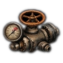 [[Items/pressure_valve|Pressure Valve]] | 3.8% |
|  [[Items/chemical_sludge|Chemical Sludge]] | 3.6% |
| 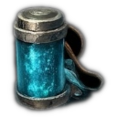 [[Items/reactor_dust|Reactor Dust]] | 2.9% |
| 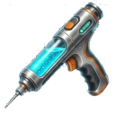 [[Items/stim_injector|Stim Injector]] | 2.9% |
| 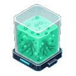 [[Items/biofuel_cell|Biofuel Cell]] | 2.4% |
| 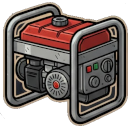 [[Items/gasoline_generator|Gasoline Generator]] | 2.4% |
| 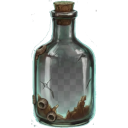 [[Items/old_glass_bottle|Old Glass Bottle]] | 2.4% |
|  [[Items/rusted_chain|Rusted Chain]] | 2.4% |
| 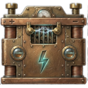 [[Items/car_battery|Car Battery]] | 1.9% |
|  [[Items/plasma_fuel_rod|Plasma Fuel Rod]] | 1.9% |
| 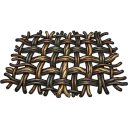 [[Items/ballistic_mesh|Ballistic Mesh]] | 1.4% |
| 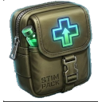 [[Items/stim_pack|Stim Pack]] | 1.4% |
| 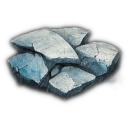 [[Items/ceramic_shards|Ceramic Shards]] | 1.2% |
|  [[Items/ceramic_armor_tile|Ceramic Armor Tile]] | 1.0% |
|  [[Items/fungal_spores|Fungal Spores]] | 1.0% |
| 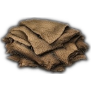 [[Items/salvaged_fabric|Salvaged Fabric]] | 1.0% |
|  [[Items/stim_overdrive|Stim Overdrive]] | 1.0% |
|  [[Items/vault_key_fragment|Vault Key Fragment]] | 1.0% |
|  [[Items/drone|Cargo Drone]] | 0.7% |
|  [[Items/fortified_rebar|Fortified Rebar]] | 0.5% |
|  [[Items/expedition_pack|Expedition Pack]] | 0.2% |
| 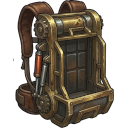 [[Items/hauler_pack|Hauler Pack]] | 0.2% |
| 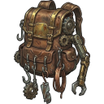 [[Items/salvager_pack|Salvager Pack]] | 0.2% |
## Technical Information
- **Asset ID**: `electronic_lab`
- **Asset Path**: `tiles/electronics_01.png`
