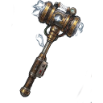
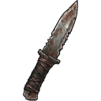
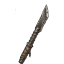
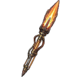

# Biome: [[Biomes/electronic_lab|Electronic Store / Lab]]

![[assets/tiles/electronics_01.png|250]]

**Description**: High-tech ruins filled with delicate components.

## Loot Tables
| Item | % Per Hour |
| :--- | :--- |
| &nbsp;[[Items/circuit_boards|Circuit&nbsp;Boards]] | 7.8% |
| &nbsp;[[Items/research_material|Research&nbsp;Material]] | 7.3% |
| &nbsp;[[Items/battery|Battery]] | 6.2% |
| &nbsp;[[Items/micro_fuse|Micro&nbsp;Fuse]] | 4.8% |
| &nbsp;[[Items/malfunctioning_sensor|Malfunctioning&nbsp;Sensor]] | 4.7% |
| &nbsp;[[Items/capacitor_bank|Capacitor&nbsp;Bank]] | 4.4% |
| &nbsp;[[Items/copper_wiring|Copper&nbsp;Wiring]] | 4.2% |
| &nbsp;[[Items/broken_radio|Broken&nbsp;Radio]] | 3.6% |
| &nbsp;[[Items/data_tape|Data&nbsp;Tape]] | 3.5% |
| &nbsp;[[Items/damaged_solar_panel|Damaged&nbsp;Solar&nbsp;Panel]] | 3.1% |
| &nbsp;[[Items/thermal_coil|Thermal&nbsp;Coil]] | 3.1% |
| &nbsp;[[Items/ionized_filament|Ionized&nbsp;Filament]] | 2.9% |
| &nbsp;[[Items/cracked_lens|Cracked&nbsp;Lens]] | 2.6% |
| &nbsp;[[Items/burnt_motor|Burnt-Out&nbsp;Motor]] | 2.6% |
| &nbsp;[[Items/filter_mesh|Filter&nbsp;Mesh]] | 2.5% |
| &nbsp;[[Items/fractured_servo|Fractured&nbsp;Servo]] | 2.5% |
| &nbsp;[[Items/cryo_flask|Cryo&nbsp;Flask]] | 2.3% |
| &nbsp;[[Items/scrap_metal|Scrap&nbsp;Metal]] | 2.1% |
| &nbsp;[[Items/lamp_empty|Lamp&nbsp;(empty)]] | 2.1% |
| &nbsp;[[Items/gasoline_generator_empty|Gasoline&nbsp;Generator&nbsp;(empty)]] | 2.1% |
| &nbsp;[[Items/ruined_generator_parts|Ruined&nbsp;Generator&nbsp;Parts]] | 2.1% |
| &nbsp;[[Items/glowing_mushroom|Glowing&nbsp;Mushroom]] | 1.7% |
| &nbsp;[[Items/shock_maul|Shock&nbsp;Maul]] | 1.7% |
| &nbsp;[[Items/pressure_valve|Pressure&nbsp;Valve]] | 1.7% |
| &nbsp;[[Items/chemical_sludge|Chemical&nbsp;Sludge]] | 1.6% |
| &nbsp;[[Items/stim_injector|Stim&nbsp;Injector]] | 1.2% |
| &nbsp;[[Items/makeshift_shiv|Makeshift&nbsp;Shiv]] | 1.2% |
| &nbsp;[[Items/rebar_blade|Rebar&nbsp;Blade]] | 1.2% |
| &nbsp;[[Items/reactor_dust|Reactor&nbsp;Dust]] | 1.2% |
| &nbsp;[[Items/old_glass_bottle|Old&nbsp;Glass&nbsp;Bottle]] | 1.0% |
| &nbsp;[[Items/gasoline_generator|Gasoline&nbsp;Generator]] | 1.0% |
| &nbsp;[[Items/biofuel_cell|Biofuel&nbsp;Cell]] | 1.0% |
| &nbsp;[[Items/rusted_chain|Rusted&nbsp;Chain]] | 1.0% |
| &nbsp;[[Items/car_battery|Car&nbsp;Battery]] | 0.8% |
| &nbsp;[[Items/plasma_lance|Plasma&nbsp;Lance]] | 0.8% |
| &nbsp;[[Items/plasma_fuel_rod|Plasma&nbsp;Fuel&nbsp;Rod]] | 0.8% |
| &nbsp;[[Items/stim_pack|Stim&nbsp;Pack]] | 0.6% |
| &nbsp;[[Items/scrap_spear|Scrap&nbsp;Spear]] | 0.6% |
| &nbsp;[[Items/ballistic_mesh|Ballistic&nbsp;Mesh]] | 0.6% |
| &nbsp;[[Items/ceramic_shards|Ceramic&nbsp;Shards]] | 0.5% |
| &nbsp;[[Items/stim_overdrive|Stim&nbsp;Overdrive]] | 0.4% |
| &nbsp;[[Items/salvaged_fabric|Salvaged&nbsp;Fabric]] | 0.4% |
| &nbsp;[[Items/fungal_spores|Fungal&nbsp;Spores]] | 0.4% |
| &nbsp;[[Items/vault_key_fragment|Vault&nbsp;Key&nbsp;Fragment]] | 0.4% |
| &nbsp;[[Items/ceramic_armor_tile|Ceramic&nbsp;Armor&nbsp;Tile]] | 0.4% |
| &nbsp;[[Items/drone|Cargo&nbsp;Drone]] | 0.3% |
| &nbsp;[[Items/fortified_rebar|Fortified&nbsp;Rebar]] | 0.2% |
| &nbsp;[[Items/ancient_relic|Ancient&nbsp;Relic]] | 0.1% |
| &nbsp;[[Items/salvager_pack|Salvager&nbsp;Pack]] | 0.1% |
| &nbsp;[[Items/expedition_pack|Expedition&nbsp;Pack]] | 0.1% |
| &nbsp;[[Items/hauler_pack|Hauler&nbsp;Pack]] | 0.1% |
## Technical Information
- **Asset ID**: `electronic_lab`
- **Asset Path**: `tiles/electronics_01.png`
