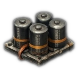
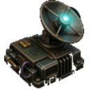
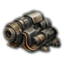
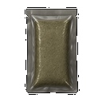
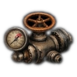
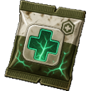
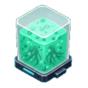
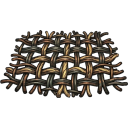

# Biome: [[Biomes/hidden_vault|Hidden Vault]]

![[assets/tiles/hidden_vault_01.png|250]]

**Description**: A sealed pre-collapse bunker filled with experimental technology.

## Loot Tables
| Item | % Per Hour |
| :--- | :--- |
| &nbsp;[[Items/ancient_relic|Ancient&nbsp;Relic]] | 5.3% |
| &nbsp;[[Items/glowing_mushroom|Glowing&nbsp;Mushroom]] | 4.8% |
| &nbsp;[[Items/gasoline_generator_empty|Gasoline&nbsp;Generator&nbsp;(empty)]] | 4.2% |
| &nbsp;[[Items/research_material|Research&nbsp;Material]] | 3.7% |
| &nbsp;[[Items/circuit_boards|Circuit&nbsp;Boards]] | 3.4% |
| &nbsp;[[Items/cryo_flask|Cryo&nbsp;Flask]] | 3.2% |
| &nbsp;[[Items/reactor_dust|Reactor&nbsp;Dust]] | 3.0% |
| &nbsp;[[Items/copper_wiring|Copper&nbsp;Wiring]] | 2.5% |
| &nbsp;[[Items/capacitor_bank|Capacitor&nbsp;Bank]] | 2.5% |
| &nbsp;[[Items/stimulant_reagent|Stimulant&nbsp;Reagent]] | 2.3% |
| &nbsp;[[Items/data_tape|Data&nbsp;Tape]] | 2.3% |
| &nbsp;[[Items/vault_key_fragment|Vault&nbsp;Key&nbsp;Fragment]] | 2.3% |
| &nbsp;[[Items/chemical_sludge|Chemical&nbsp;Sludge]] | 2.1% |
| &nbsp;[[Items/gasoline_canister|Gasoline&nbsp;Canister]] | 2.1% |
| &nbsp;[[Items/micro_fuse|Micro&nbsp;Fuse]] | 2.1% |
| &nbsp;[[Items/thermal_coil|Thermal&nbsp;Coil]] | 1.9% |
| &nbsp;[[Items/beacon_component|Beacon&nbsp;Component]] | 1.9% |
| &nbsp;[[Items/ionized_filament|Ionized&nbsp;Filament]] | 1.9% |
| &nbsp;[[Items/sterile_syringe|Sterile&nbsp;Syringe]] | 1.7% |
| &nbsp;[[Items/gasoline_generator|Gasoline&nbsp;Generator]] | 1.7% |
| &nbsp;[[Items/fractured_servo|Fractured&nbsp;Servo]] | 1.7% |
| &nbsp;[[Items/trauma_stabilizer|Trauma&nbsp;Stabilizer]] | 1.6% |
| &nbsp;[[Items/lamp_empty|Lamp&nbsp;(empty)]] | 1.6% |
| &nbsp;[[Items/plasma_lance|Plasma&nbsp;Lance]] | 1.6% |
| &nbsp;[[Items/malfunctioning_sensor|Malfunctioning&nbsp;Sensor]] | 1.6% |
| &nbsp;[[Items/plasma_fuel_rod|Plasma&nbsp;Fuel&nbsp;Rod]] | 1.5% |
| &nbsp;[[Items/nutrient_paste|Nutrient&nbsp;Paste]] | 1.3% |
| &nbsp;[[Items/first_aid_kit|First&nbsp;Aid&nbsp;Kit]] | 1.3% |
| &nbsp;[[Items/shock_maul|Shock&nbsp;Maul]] | 1.3% |
| &nbsp;[[Items/pressure_valve|Pressure&nbsp;Valve]] | 1.3% |
| &nbsp;[[Items/bio_resin|Bio&nbsp;Resin]] | 1.3% |
| &nbsp;[[Items/water|Clean&nbsp;Water]] | 1.1% |
| &nbsp;[[Items/protein_bar|Protein&nbsp;Bar]] | 1.1% |
| &nbsp;[[Items/stim_overdrive|Stim&nbsp;Overdrive]] | 1.1% |
| &nbsp;[[Items/scrap_metal|Scrap&nbsp;Metal]] | 1.1% |
| &nbsp;[[Items/med_gauze|Medical&nbsp;Gauze]] | 1.1% |
| &nbsp;[[Items/vital_stasis_patch|Vital&nbsp;Stasis&nbsp;Patch]] | 1.1% |
| &nbsp;[[Items/battery|Battery]] | 1.1% |
| &nbsp;[[Items/bottle_of_alcohol|Bottle&nbsp;of&nbsp;Alcohol]] | 1.1% |
| &nbsp;[[Items/filter_mesh|Filter&nbsp;Mesh]] | 1.1% |
| &nbsp;[[Items/obsidian_flake|Obsidian&nbsp;Flake]] | 1.1% |
| &nbsp;[[Items/mutant_seed_pod|Mutant&nbsp;Seed&nbsp;Pod]] | 1.1% |
| &nbsp;[[Items/rebar_blade|Rebar&nbsp;Blade]] | 1.0% |
| &nbsp;[[Items/drone|Cargo&nbsp;Drone]] | 0.8% |
| &nbsp;[[Items/crimson_flare|Crimson&nbsp;Flare]] | 0.8% |
| &nbsp;[[Items/biofuel_cell|Biofuel&nbsp;Cell]] | 0.8% |
| &nbsp;[[Items/ceramic_shards|Ceramic&nbsp;Shards]] | 0.8% |
| &nbsp;[[Items/ceramic_armor_tile|Ceramic&nbsp;Armor&nbsp;Tile]] | 0.8% |
| &nbsp;[[Items/stim_injector|Stim&nbsp;Injector]] | 0.7% |
| &nbsp;[[Items/ceramic_pot|Ceramic&nbsp;Pot]] | 0.6% |
| &nbsp;[[Items/rusted_chain|Rusted&nbsp;Chain]] | 0.6% |
| &nbsp;[[Items/ballistic_mesh|Ballistic&nbsp;Mesh]] | 0.6% |
| &nbsp;[[Items/canned_beans|Canned&nbsp;Beans]] | 0.5% |
| &nbsp;[[Items/soup_can|Soup&nbsp;Can]] | 0.5% |
| &nbsp;[[Items/mineral_water|Mineral&nbsp;Water]] | 0.5% |
| &nbsp;[[Items/energy_soda|Energy&nbsp;Soda]] | 0.5% |
| &nbsp;[[Items/stone|Hardened&nbsp;Stone]] | 0.5% |
| &nbsp;[[Items/field_bandage|Field&nbsp;Bandage]] | 0.5% |
| &nbsp;[[Items/fungal_spores|Fungal&nbsp;Spores]] | 0.5% |
| &nbsp;[[Items/mace_spray_mythic|Neurotoxin&nbsp;Mace]] | 0.4% |
| &nbsp;[[Items/car_battery|Car&nbsp;Battery]] | 0.4% |
| &nbsp;[[Items/makeshift_shiv|Makeshift&nbsp;Shiv]] | 0.4% |
| &nbsp;[[Items/salt_crystals|Salt&nbsp;Crystals]] | 0.4% |
| &nbsp;[[Items/dried_jerky|Dried&nbsp;Jerky]] | 0.3% |
| &nbsp;[[Items/stale_bread|Stale&nbsp;Bread]] | 0.3% |
| &nbsp;[[Items/fermented_cider|Fermented&nbsp;Cider]] | 0.3% |
| &nbsp;[[Items/stim_pack|Stim&nbsp;Pack]] | 0.3% |
| &nbsp;[[Items/survival_shelter|Survival&nbsp;Shelter]] | 0.3% |
| &nbsp;[[Items/old_glass_bottle|Old&nbsp;Glass&nbsp;Bottle]] | 0.3% |
| &nbsp;[[Items/nova_flare|Nova&nbsp;Flare]] | 0.3% |
| &nbsp;[[Items/scrap_spear|Scrap&nbsp;Spear]] | 0.3% |
| &nbsp;[[Items/salvaged_fabric|Salvaged&nbsp;Fabric]] | 0.3% |
| &nbsp;[[Items/rations|Rations]] | 0.2% |
| &nbsp;[[Items/herbal_tea|Herbal&nbsp;Tea]] | 0.2% |
| &nbsp;[[Items/expedition_tent|Expedition&nbsp;Tent]] | 0.2% |
| &nbsp;[[Items/salvager_pack|Salvager&nbsp;Pack]] | 0.2% |
| &nbsp;[[Items/expedition_pack|Expedition&nbsp;Pack]] | 0.2% |
| &nbsp;[[Items/charred_planks|Charred&nbsp;Planks]] | 0.2% |
| &nbsp;[[Items/wild_berries|Wild&nbsp;Berries]] | 0.1% |
## Technical Information
- **Asset ID**: `hidden_vault`
- **Asset Path**: `tiles/hidden_vault_01.png`
