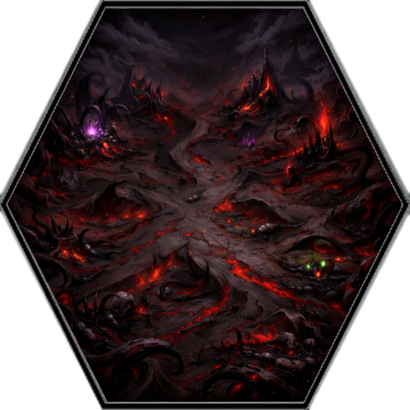

# Hex Survival Biomes

Explore the different hexagonal tiles and facilities of the world. Each biome has unique resource concentrations and strategic value.

## Biome Directory

###  [[Biomes/farm_facility|Human Farm Facility]]
The primary source of food. High concentration of **Rations** and **Salad**.

###  [[Biomes/hidden_vault|Hidden Vault]]
Rare bunkers containing **Ancient Relics**, **Cargo Drones**, and high-value research materials.

###  [[Biomes/oasis|Oasis]]
Rare fertile areas and the primary source of **Clean Water**.

###  [[Biomes/electronic_lab|Electronic Store / Lab]]
High-tech facilities containing **Circuit Boards**, **Batteries**, and **Targeting Relays**.

###  [[Biomes/industrial|Industrial Zone]]
Processing complexes and the primary source for **Ballistic Mesh**, **Chemical Sludge**, and **Fuel**.

###  [[Biomes/ruined_city|Ruined City]]
Dense urban ruins and the primary source for **Scrap Metal**, **Fortified Rebar**, and salvageable junk.

###  [[Biomes/forest|Forest]]
Wooded areas and the primary source for **Raw Timber** and **Glowing Mushrooms**.

###  [[Biomes/mountain|Mountain / Quarry]]
Rocky terrain and the primary source for **Hardened Stone** and **Quarry Bolts**.

###  [[Biomes/desert|Desert / Sand]]
Barren terrain providing **Hardened Stone** and **Raw Timber**.

### 💀 [[Biomes/corrupted_1|Corrupted Tiles]]
Lethal zones of darkness that serve as spawn points for **Monster Hordes**.
-  [[Biomes/corrupted_1|Corrupted Tile I]]
-  [[Biomes/corrupted_2|Corrupted Tile II]]
-  [[Biomes/corrupted_3|Corrupted Tile III]]
-  [[Biomes/corrupted_4|Corrupted Tile IV]]
-  [[Biomes/corrupted_5|Corrupted Tile V]]
