# Biome: [[Biomes/oasis|Oasis]]

![[assets/tiles/oasis_01.png|250]]

**Description**: A rare haven of water and life.

## Loot Tables
| Item | % Per Hour |
| :--- | :--- |
| &nbsp;[[Items/water|Clean&nbsp;Water]] | 25.0% |
| &nbsp;[[Items/glowing_mushroom|Glowing&nbsp;Mushroom]] | 9.7% |
| 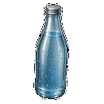&nbsp;[[Items/mineral_water|Mineral&nbsp;Water]] | 6.4% |
| 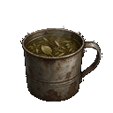&nbsp;[[Items/herbal_tea|Herbal&nbsp;Tea]] | 5.6% |
| &nbsp;[[Items/bio_resin|Bio&nbsp;Resin]] | 5.6% |
| 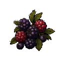&nbsp;[[Items/wild_berries|Wild&nbsp;Berries]] | 5.0% |
| 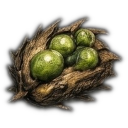&nbsp;[[Items/mutant_seed_pod|Mutant&nbsp;Seed&nbsp;Pod]] | 5.0% |
| &nbsp;[[Items/ceramic_pot|Ceramic&nbsp;Pot]] | 3.9% |
| &nbsp;[[Items/fungal_spores|Fungal&nbsp;Spores]] | 3.9% |
| &nbsp;[[Items/timber|Raw&nbsp;Timber]] | 2.8% |
| 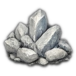&nbsp;[[Items/salt_crystals|Salt&nbsp;Crystals]] | 2.8% |
| 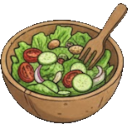&nbsp;[[Items/salad|Salad]] | 2.2% |
| &nbsp;[[Items/old_glass_bottle|Old&nbsp;Glass&nbsp;Bottle]] | 1.7% |
| &nbsp;[[Items/salvaged_fabric|Salvaged&nbsp;Fabric]] | 1.7% |
| 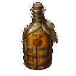&nbsp;[[Items/fermented_cider|Fermented&nbsp;Cider]] | 1.4% |
| &nbsp;[[Items/stone|Hardened&nbsp;Stone]] | 1.4% |
| &nbsp;[[Items/charred_planks|Charred&nbsp;Planks]] | 1.4% |
| 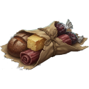&nbsp;[[Items/rations|Rations]] | 1.1% |
| &nbsp;[[Items/dried_jerky|Dried&nbsp;Jerky]] | 1.1% |
| &nbsp;[[Items/field_bandage|Field&nbsp;Bandage]] | 1.1% |
| &nbsp;[[Items/scrap_spear|Scrap&nbsp;Spear]] | 1.1% |
| &nbsp;[[Items/ceramic_shards|Ceramic&nbsp;Shards]] | 1.1% |
| &nbsp;[[Items/med_gauze|Medical&nbsp;Gauze]] | 0.8% |
| &nbsp;[[Items/makeshift_shiv|Makeshift&nbsp;Shiv]] | 0.8% |
| &nbsp;[[Items/bottle_of_alcohol|Bottle&nbsp;of&nbsp;Alcohol]] | 0.8% |
| 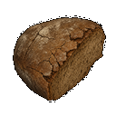&nbsp;[[Items/stale_bread|Stale&nbsp;Bread]] | 0.6% |
| &nbsp;[[Items/stim_pack|Stim&nbsp;Pack]] | 0.6% |
| &nbsp;[[Items/first_aid_kit|First&nbsp;Aid&nbsp;Kit]] | 0.6% |
| &nbsp;[[Items/stimulant_reagent|Stimulant&nbsp;Reagent]] | 0.6% |
| &nbsp;[[Items/filter_mesh|Filter&nbsp;Mesh]] | 0.6% |
| 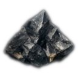&nbsp;[[Items/obsidian_flake|Obsidian&nbsp;Flake]] | 0.6% |
| 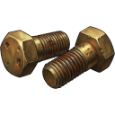&nbsp;[[Items/quarry_bolts|Quarry&nbsp;Bolts]] | 0.6% |
| 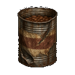&nbsp;[[Items/canned_beans|Canned&nbsp;Beans]] | 0.3% |
| 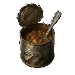&nbsp;[[Items/soup_can|Soup&nbsp;Can]] | 0.3% |
| 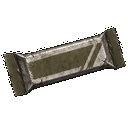&nbsp;[[Items/protein_bar|Protein&nbsp;Bar]] | 0.3% |
| 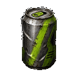&nbsp;[[Items/energy_soda|Energy&nbsp;Soda]] | 0.3% |
| &nbsp;[[Items/ancient_relic|Ancient&nbsp;Relic]] | 0.3% |
| 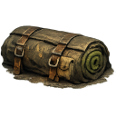&nbsp;[[Items/field_bedroll|Field&nbsp;Bedroll]] | 0.3% |
| 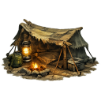&nbsp;[[Items/survival_shelter|Survival&nbsp;Shelter]] | 0.3% |
| &nbsp;[[Items/salvager_pack|Salvager&nbsp;Pack]] | 0.3% |
| &nbsp;[[Items/expedition_pack|Expedition&nbsp;Pack]] | 0.3% |
| &nbsp;[[Items/fortified_rebar|Fortified&nbsp;Rebar]] | 0.3% |
## Technical Information
- **Asset ID**: `oasis`
- **Asset Path**: `tiles/oasis_01.png`
