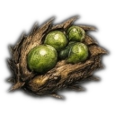

# Biome: [[Biomes/ruined_city|Ruined City]]

![[assets/tiles/ruined_city_01.png|250]]

**Description**: Urban remains of a pre-collapse metropolis.

## Loot Tables (Absolute Success Probability (% per hour))
| Item | % Per Hour |
| :--- | :--- |
|  [[Items/scrap_metal|Scrap Metal]] | 8.7% |
|  [[Items/lamp_empty|Lamp (empty)]] | 4.6% |
|  [[Items/old_glass_bottle|Old Glass Bottle]] | 4.6% |
|  [[Items/car_battery|Car Battery]] | 4.1% |
|  [[Items/ceramic_shards|Ceramic Shards]] | 3.9% |
|  [[Items/makeshift_shiv|Makeshift Shiv]] | 3.6% |
|  [[Items/salvaged_fabric|Salvaged Fabric]] | 3.6% |
|  [[Items/rusted_chain|Rusted Chain]] | 3.3% |
|  [[Items/copper_wiring|Copper Wiring]] | 3.1% |
|  [[Items/rusty_tool|Rusty Tool]] | 3.1% |
|  [[Items/broken_radio|Broken Radio]] | 2.6% |
|  [[Items/empty_canister|Empty Canister]] | 2.6% |
|  [[Items/broken_binoculars|Broken Binoculars]] | 2.6% |
|  [[Items/ruined_generator_parts|Ruined Generator Parts]] | 2.6% |
|  [[Items/charred_planks|Charred Planks]] | 2.5% |
|  [[Items/fortified_rebar|Fortified Rebar]] | 2.5% |
|  [[Items/scrap_spear|Scrap Spear]] | 2.2% |
|  [[Items/rations|Rations]] | 2.0% |
|  [[Items/gasoline_canister|Gasoline Canister]] | 2.0% |
|  [[Items/cracked_lens|Cracked Lens]] | 2.0% |
|  [[Items/filter_mesh|Filter Mesh]] | 2.0% |
|  [[Items/glowing_mushroom|Glowing Mushroom]] | 1.8% |
|  [[Items/water|Clean Water]] | 1.5% |
|  [[Items/timber|Raw Timber]] | 1.5% |
|  [[Items/stone|Hardened Stone]] | 1.5% |
|  [[Items/rebar_blade|Rebar Blade]] | 1.5% |
|  [[Items/burnt_motor|Burnt-Out Motor]] | 1.5% |
|  [[Items/worn_leather_pack|Worn Leather Pack]] | 1.5% |
|  [[Items/stim_pack|Stim Pack]] | 1.4% |
|  [[Items/fractured_servo|Fractured Servo]] | 1.4% |
|  [[Items/pressure_valve|Pressure Valve]] | 1.2% |
|  [[Items/gasoline_generator_empty|Gasoline Generator (empty)]] | 1.0% |
|  [[Items/capacitor_bank|Capacitor Bank]] | 1.0% |
|  [[Items/thermal_coil|Thermal Coil]] | 1.0% |
|  [[Items/fungal_spores|Fungal Spores]] | 1.0% |
|  [[Items/quarry_bolts|Quarry Bolts]] | 1.0% |
|  [[Items/circuit_boards|Circuit Boards]] | 0.8% |
|  [[Items/shock_maul|Shock Maul]] | 0.8% |
|  [[Items/micro_fuse|Micro Fuse]] | 0.8% |
|  [[Items/data_tape|Data Tape]] | 0.8% |
|  [[Items/bio_resin|Bio Resin]] | 0.8% |
|  [[Items/ballistic_mesh|Ballistic Mesh]] | 0.8% |
|  [[Items/stim_injector|Stim Injector]] | 0.7% |
|  [[Items/gasoline_generator|Gasoline Generator]] | 0.6% |
|  [[Items/research_material|Research Material]] | 0.6% |
|  [[Items/salt_crystals|Salt Crystals]] | 0.6% |
|  [[Items/ionized_filament|Ionized Filament]] | 0.6% |
|  [[Items/mutant_seed_pod|Mutant Seed Pod]] | 0.6% |
|  [[Items/chemical_sludge|Chemical Sludge]] | 0.5% |
|  [[Items/battery|Battery]] | 0.5% |
|  [[Items/ceramic_armor_tile|Ceramic Armor Tile]] | 0.5% |
|  [[Items/cryo_flask|Cryo Flask]] | 0.4% |
|  [[Items/obsidian_flake|Obsidian Flake]] | 0.4% |
|  [[Items/salad|Salad]] | 0.2% |
|  [[Items/plasma_lance|Plasma Lance]] | 0.2% |
|  [[Items/stim_overdrive|Stim Overdrive]] | 0.1% |
|  [[Items/drone|Cargo Drone]] | 0.1% |
|  [[Items/salvager_pack|Salvager Pack]] | 0.1% |
|  [[Items/vault_key_fragment|Vault Key Fragment]] | 0.1% |
## Technical Information
- **Asset ID**: `ruined_city`
- **Asset Path**: `tiles/ruined_city_01.png`
