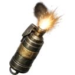
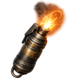

# Biome: [[Biomes/ruined_city|Ruined City]]

![[assets/tiles/ruined_city_01.png|250]]

**Description**: Urban remains of a pre-collapse metropolis.

## Loot Tables
| Item | % Per Hour |
| :--- | :--- |
| &nbsp;[[Items/Unknown/scrap_metal|Scrap&nbsp;Metal]] | 6.8% |
| &nbsp;[[Items/Unknown/lamp_empty|Lamp&nbsp;(empty)]] | 3.6% |
| &nbsp;[[Items/Unknown/car_battery|Car&nbsp;Battery]] | 3.2% |
| &nbsp;[[Items/Unknown/ceramic_shards|Ceramic&nbsp;Shards]] | 3.0% |
| &nbsp;[[Items/Unknown/copper_wiring|Copper&nbsp;Wiring]] | 2.9% |
| &nbsp;[[Items/Unknown/salvaged_fabric|Salvaged&nbsp;Fabric]] | 2.8% |
| &nbsp;[[Items/Unknown/circuit_boards|Circuit&nbsp;Boards]] | 2.6% |
| &nbsp;[[Items/Unknown/rusted_chain|Rusted&nbsp;Chain]] | 2.6% |
| &nbsp;[[Items/Weapon/makeshift_shiv|Makeshift&nbsp;Shiv]] | 2.4% |
| &nbsp;[[Items/Unknown/ruined_generator_parts|Ruined&nbsp;Generator&nbsp;Parts]] | 2.4% |
| &nbsp;[[Items/Medical/med_gauze|Medical&nbsp;Gauze]] | 2.2% |
| &nbsp;[[Items/Unknown/ceramic_pot|Ceramic&nbsp;Pot]] | 2.2% |
| &nbsp;[[Items/Unknown/rusty_tool|Rusty&nbsp;Tool]] | 2.1% |
| &nbsp;[[Items/Unknown/broken_radio|Broken&nbsp;Radio]] | 2.0% |
| &nbsp;[[Items/Unknown/cracked_lens|Cracked&nbsp;Lens]] | 2.0% |
| &nbsp;[[Items/Unknown/empty_canister|Empty&nbsp;Canister]] | 2.0% |
| &nbsp;[[Items/Unknown/broken_binoculars|Broken&nbsp;Binoculars]] | 2.0% |
| &nbsp;[[Items/Unknown/charred_planks|Charred&nbsp;Planks]] | 1.9% |
| &nbsp;[[Items/Unknown/fortified_rebar|Fortified&nbsp;Rebar]] | 1.9% |
| &nbsp;[[Items/Unknown/sterile_syringe|Sterile&nbsp;Syringe]] | 1.8% |
| &nbsp;[[Items/Unknown/rations|Rations]] | 1.6% |
| &nbsp;[[Items/Fuel/gasoline_canister|Gasoline&nbsp;Canister]] | 1.6% |
| &nbsp;[[Items/Unknown/filter_mesh|Filter&nbsp;Mesh]] | 1.6% |
| &nbsp;[[Items/Weapon/scrap_spear|Scrap&nbsp;Spear]] | 1.5% |
| &nbsp;[[Items/Unknown/canned_beans|Canned&nbsp;Beans]] | 1.4% |
| &nbsp;[[Items/Medical/field_bandage|Field&nbsp;Bandage]] | 1.4% |
| &nbsp;[[Items/Unknown/glowing_mushroom|Glowing&nbsp;Mushroom]] | 1.4% |
| &nbsp;[[Items/Medical/bottle_of_alcohol|Bottle&nbsp;of&nbsp;Alcohol]] | 1.4% |
| &nbsp;[[Items/Unknown/soup_can|Soup&nbsp;Can]] | 1.4% |
| &nbsp;[[Items/Unknown/stale_bread|Stale&nbsp;Bread]] | 1.3% |
| &nbsp;[[Items/Unknown/old_glass_bottle|Old&nbsp;Glass&nbsp;Bottle]] | 1.3% |
| &nbsp;[[Items/Unknown/water|Clean&nbsp;Water]] | 1.2% |
| &nbsp;[[Items/Unknown/timber|Raw&nbsp;Timber]] | 1.2% |
| &nbsp;[[Items/Unknown/burnt_motor|Burnt-Out&nbsp;Motor]] | 1.2% |
| &nbsp;[[Items/Unknown/worn_leather_pack|Worn&nbsp;Leather&nbsp;Pack]] | 1.2% |
| &nbsp;[[Items/Unknown/stim_pack|Stim&nbsp;Pack]] | 1.1% |
| &nbsp;[[Items/Unknown/fractured_servo|Fractured&nbsp;Servo]] | 1.1% |
| &nbsp;[[Items/Weapon/rebar_blade|Rebar&nbsp;Blade]] | 1.0% |
| &nbsp;[[Items/Unknown/fishing_line|Fishing&nbsp;Line]] | 1.0% |
| &nbsp;[[Items/Unknown/pressure_valve|Pressure&nbsp;Valve]] | 1.0% |
| &nbsp;[[Items/Unknown/quarry_bolts|Quarry&nbsp;Bolts]] | 1.0% |
| &nbsp;[[Items/Unknown/energy_soda|Energy&nbsp;Soda]] | 0.8% |
| &nbsp;[[Items/Medical/first_aid_kit|First&nbsp;Aid&nbsp;Kit]] | 0.8% |
| &nbsp;[[Items/Unknown/stimulant_reagent|Stimulant&nbsp;Reagent]] | 0.8% |
| &nbsp;[[Items/Unknown/gasoline_generator_empty|Gasoline&nbsp;Generator&nbsp;(empty)]] | 0.8% |
| &nbsp;[[Items/Unknown/capacitor_bank|Capacitor&nbsp;Bank]] | 0.8% |
| &nbsp;[[Items/Unknown/thermal_coil|Thermal&nbsp;Coil]] | 0.8% |
| &nbsp;[[Items/Unknown/protein_bar|Protein&nbsp;Bar]] | 0.6% |
| &nbsp;[[Items/Unknown/mace_spray_common|Irritant&nbsp;Mace]] | 0.6% |
| &nbsp;[[Items/Light/spark_flare|Spark&nbsp;Flare]] | 0.6% |
| &nbsp;[[Items/Unknown/micro_fuse|Micro&nbsp;Fuse]] | 0.6% |
| &nbsp;[[Items/Unknown/data_tape|Data&nbsp;Tape]] | 0.6% |
| &nbsp;[[Items/Unknown/bio_resin|Bio&nbsp;Resin]] | 0.6% |
| &nbsp;[[Items/Unknown/fungal_spores|Fungal&nbsp;Spores]] | 0.6% |
| &nbsp;[[Items/Unknown/ballistic_mesh|Ballistic&nbsp;Mesh]] | 0.6% |
| &nbsp;[[Items/Unknown/stim_injector|Stim&nbsp;Injector]] | 0.6% |
| &nbsp;[[Items/Weapon/shock_maul|Shock&nbsp;Maul]] | 0.6% |
| &nbsp;[[Items/Unknown/fermented_cider|Fermented&nbsp;Cider]] | 0.5% |
| &nbsp;[[Items/Unknown/mace_spray_uncommon|Concentrated&nbsp;Mace]] | 0.5% |
| &nbsp;[[Items/Power/gasoline_generator|Gasoline&nbsp;Generator]] | 0.5% |
| &nbsp;[[Items/Unknown/research_material|Research&nbsp;Material]] | 0.5% |
| &nbsp;[[Items/Unknown/damaged_solar_panel|Damaged&nbsp;Solar&nbsp;Panel]] | 0.5% |
| &nbsp;[[Items/Unknown/salt_crystals|Salt&nbsp;Crystals]] | 0.5% |
| &nbsp;[[Items/Unknown/ionized_filament|Ionized&nbsp;Filament]] | 0.5% |
| &nbsp;[[Items/Unknown/mutant_seed_pod|Mutant&nbsp;Seed&nbsp;Pod]] | 0.5% |
| &nbsp;[[Items/Unknown/stone|Hardened&nbsp;Stone]] | 0.4% |
| &nbsp;[[Items/Unknown/chemical_sludge|Chemical&nbsp;Sludge]] | 0.4% |
| &nbsp;[[Items/Unknown/battery|Battery]] | 0.4% |
| &nbsp;[[Items/Unknown/salvager_pack|Salvager&nbsp;Pack]] | 0.4% |
| &nbsp;[[Items/Unknown/ceramic_armor_tile|Ceramic&nbsp;Armor&nbsp;Tile]] | 0.4% |
| &nbsp;[[Items/Unknown/dried_jerky|Dried&nbsp;Jerky]] | 0.3% |
| &nbsp;[[Items/Unknown/solar_cell|Solar&nbsp;Cell]] | 0.3% |
| &nbsp;[[Items/Unknown/cryo_flask|Cryo&nbsp;Flask]] | 0.3% |
| &nbsp;[[Items/Unknown/obsidian_flake|Obsidian&nbsp;Flake]] | 0.3% |
| &nbsp;[[Items/Unknown/herbal_tea|Herbal&nbsp;Tea]] | 0.2% |
| &nbsp;[[Items/Unknown/mace_spray_rare|Military&nbsp;Mace]] | 0.2% |
| &nbsp;[[Items/Unknown/drone|Cargo&nbsp;Drone]] | 0.2% |
| &nbsp;[[Items/Light/signal_flare|Signal&nbsp;Flare]] | 0.2% |
| &nbsp;[[Items/Unknown/salad|Salad]] | 0.2% |
| &nbsp;[[Items/Unknown/nutrient_paste|Nutrient&nbsp;Paste]] | 0.2% |
| &nbsp;[[Items/Unknown/mineral_water|Mineral&nbsp;Water]] | 0.2% |
| &nbsp;[[Items/Camp/field_bedroll|Field&nbsp;Bedroll]] | 0.2% |
| &nbsp;[[Items/Medical/trauma_stabilizer|Trauma&nbsp;Stabilizer]] | 0.2% |
| &nbsp;[[Items/Weapon/plasma_lance|Plasma&nbsp;Lance]] | 0.2% |
| &nbsp;[[Items/Unknown/beacon_component|Beacon&nbsp;Component]] | 0.2% |
| &nbsp;[[Items/Unknown/wild_berries|Wild&nbsp;Berries]] | 0.1% |
| &nbsp;[[Items/Unknown/stim_overdrive|Stim&nbsp;Overdrive]] | 0.1% |
| &nbsp;[[Items/Unknown/ancient_relic|Ancient&nbsp;Relic]] | 0.1% |
| &nbsp;[[Items/Unknown/mace_spray_mythic|Neurotoxin&nbsp;Mace]] | 0.1% |
| &nbsp;[[Items/Camp/survival_shelter|Survival&nbsp;Shelter]] | 0.1% |
| &nbsp;[[Items/Medical/vital_stasis_patch|Vital&nbsp;Stasis&nbsp;Patch]] | 0.1% |
| &nbsp;[[Items/Unknown/expedition_pack|Expedition&nbsp;Pack]] | 0.1% |
| &nbsp;[[Items/Unknown/vault_key_fragment|Vault&nbsp;Key&nbsp;Fragment]] | 0.1% |
## Technical Information
- **Asset ID**: `ruined_city`
- **Asset Path**: `tiles/ruined_city_01.png`
