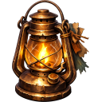

# [[Items/Light/index|Light Items]]

Directory of all items in the Light category.

*  **[[Items/Light/crimson_flare|Crimson Flare]]** (Mythic)
*  **[[Items/Light/lamp_functioning|Functioning Lamp]]** (Rare)
*  **[[Items/Light/glowing_bottle|Glowing Bottle]]** (Common)
*  **[[Items/Light/nova_flare|Nova Flare]]** (Mythic)
*  **[[Items/Light/signal_flare|Signal Flare]]** (Mythic)
*  **[[Items/Light/spark_flare|Spark Flare]]** (Mythic)
*  **[[Items/Light/starter_lamp|Starter Lamp]]** (Common)
