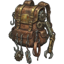
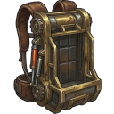

--- 
title: "Filter Mesh"
---

# Item: [[Items/Unknown/filter_mesh|Filter Mesh]]

![[assets/items/filter_mesh.png|150]]

Fine wire mesh from masks and vents; still usable for filtration rigs.

## Where to Find
- **[[Biomes/industrial|Industrial]]**: 2.5% drop chance
- **[[Biomes/electronic_lab|Electronic Lab]]**: 2.2% drop chance
- **[[Biomes/ruined_city|Ruined City]]**: 1.6% drop chance
- **[[Biomes/hidden_vault|Hidden Vault]]**: 1.1% drop chance
- **[[Biomes/desert|Desert]]**: 1.4% drop chance
- **[[Biomes/farm_facility|Farm Facility]]**: 0.8% drop chance
- **[[Biomes/forest|Forest]]**: 0.7% drop chance
- **[[Biomes/mountain|Mountain]]**: 0.8% drop chance
- **[[Biomes/oasis|Oasis]]**: 0.5% drop chance
## Combinations
### Used To Craft
**Workshop ([[Base/Constructions/assembly_bench|Assembly Bench]])**
- 1x [[Items/Medical/first_aid_kit|First Aid Kit]] + 1x [[Items/Unknown/sterile_syringe|Sterile Syringe]] + 1x [[Items/Unknown/filter_mesh|Filter Mesh]] → 1x [[Items/Medical/trauma_stabilizer|Trauma Stabilizer]]
- 1x [[Items/Unknown/expedition_pack|Expedition Pack]] + 2x [[Items/Unknown/salvaged_fabric|Salvaged Fabric]] + 2x [[Items/Unknown/filter_mesh|Filter Mesh]] → 1x [[Items/Unknown/hauler_pack|Hauler Pack]]
- 1x [[Items/Unknown/filter_mesh|Filter Mesh]] + 1x [[Items/Unknown/copper_wiring|Copper Wiring]] + 2x [[Items/Unknown/scrap_metal|Scrap Metal]] + 1x [[Items/Unknown/old_glass_bottle|Old Glass Bottle]] → 1x [[Items/Tool/humidity_extractor|Humidity Extractor]]

## Usage

### Used in Recipes
*  [[Items/Unknown/salvager_pack|Salvager Pack]]
*  [[Items/Unknown/hauler_pack|Hauler Pack]]

## Required For
### Objectives
- [[Objectives/story_daily_water_purification_push|Water Purification Push]] (2x)
- [[Objectives/story_lock_down_artifacts|Lock Down Artifacts]] (2x)
- [[Objectives/story_quarantine_hot_samples|Quarantine Hot Samples]] (2x)
- [[Objectives/story_cool_the_core|Cool the Core]] (2x)

## Technical Information
- **Item ID**: `filter_mesh`
- **Rarity**: Common

- **Asset ID**: `filter_mesh`
- **Asset Path**: `assets/items/filter_mesh.png`
