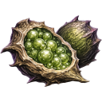
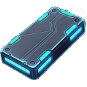
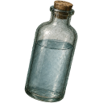
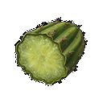
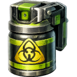
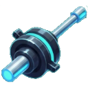
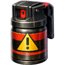
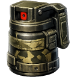

# [[Items/Unknown/index|Unknown Items]]

Directory of all items in the Unknown category.

*  **[[Items/Unknown/alien_vegetable|Alien Vegetable]]** (Uncommon)
*  **[[Items/Unknown/alloy_plate|Alloy Plate]]** (Rare)
*  **[[Items/Unknown/ancient_relic|Ancient Relic]]** (Mythic)
*  **[[Items/Unknown/ballistic_mesh|Ballistic Mesh]]** (Rare)
*  **[[Items/Unknown/battery|Battery]]** (Common)
*  **[[Items/Unknown/beacon_component|Beacon Component]]** (Mythic)
*  **[[Items/Unknown/bio_resin|Bio Resin]]** (Common)
*  **[[Items/Unknown/bio_spike_pod|Bio Spike Pod]]** (Rare)
*  **[[Items/Unknown/water_bottle|Bottle of Water]]** (Common)
*  **[[Items/Unknown/broken_binoculars|Broken Binoculars]]** (Common)
*  **[[Items/Unknown/broken_radio|Broken Radio]]** (Common)
*  **[[Items/Unknown/burnt_motor|Burnt-Out Motor]]** (Common)
*  **[[Items/Unknown/cactus_pulp|Cactus Pulp]]** (Common)
*  **[[Items/Unknown/calibrated_sensor|Calibrated Sensor]]** (Rare)
*  **[[Items/Unknown/canned_beans|Canned Beans]]** (Common)
*  **[[Items/Unknown/capacitor_bank|Capacitor Bank]]** (Rare)
*  **[[Items/Unknown/car_battery|Car Battery]]** (Common)
*  **[[Items/Unknown/drone|Cargo Drone]]** (Mythic)
*  **[[Items/Unknown/ceramic_armor_tile|Ceramic Armor Tile]]** (Rare)
*  **[[Items/Unknown/ceramic_pot|Ceramic Pot]]** (Common)
*  **[[Items/Unknown/ceramic_shards|Ceramic Shards]]** (Common)
*  **[[Items/Unknown/charred_planks|Charred Planks]]** (Common)
*  **[[Items/Unknown/chemical_sludge|Chemical Sludge]]** (Rare)
*  **[[Items/Unknown/circuit_boards|Circuit Boards]]** (Rare)
*  **[[Items/Unknown/water|Clean Water]]** (Common)
*  **[[Items/Unknown/cleanse_vial|Cleanse Vial]]** (Rare)
*  **[[Items/Unknown/mace_spray_uncommon|Concentrated Mace]]** (Uncommon)
*  **[[Items/Unknown/copper_wiring|Copper Wiring]]** (Common)
*  **[[Items/Unknown/cracked_lens|Cracked Lens]]** (Common)
*  **[[Items/Unknown/cryo_flask|Cryo Flask]]** (Rare)
*  **[[Items/Unknown/damaged_solar_panel|Damaged Solar Panel]]** (Uncommon)
*  **[[Items/Unknown/data_tape|Data Tape]]** (Rare)
*  **[[Items/Unknown/dried_jerky|Dried Jerky]]** (Common)
*  **[[Items/Unknown/empty_canister|Empty Canister]]** (Common)
*  **[[Items/Unknown/energy_soda|Energy Soda]]** (Uncommon)
*  **[[Items/Unknown/expedition_pack|Expedition Pack]]** (Rare)
*  **[[Items/Unknown/hauler_drone|Fabrication Hauler Drone]]** (Uncommon)
*  **[[Items/Unknown/fermented_cider|Fermented Cider]]** (Uncommon)
*  **[[Items/Unknown/field_radio|Field Radio]]** (Rare)
*  **[[Items/Unknown/filter_mesh|Filter Mesh]]** (Common)
*  **[[Items/Unknown/fishing_line|Fishing Line]]** (Common)
*  **[[Items/Unknown/fortified_rebar|Fortified Rebar]]** (Common)
*  **[[Items/Unknown/fractured_servo|Fractured Servo]]** (Rare)
*  **[[Items/Unknown/fungal_spores|Fungal Spores]]** (Common)
*  **[[Items/Unknown/gasoline_generator_empty|Gasoline Generator (empty)]]** (Common)
*  **[[Items/Unknown/glowing_mushroom|Glowing Mushroom]]** (Common)
*  **[[Items/Unknown/hardened_actuator|Hardened Actuator]]** (Rare)
*  **[[Items/Unknown/stone|Hardened Stone]]** (Common)
*  **[[Items/Unknown/hauler_pack|Hauler Pack]]** (Mythic)
*  **[[Items/Unknown/herbal_tea|Herbal Tea]]** (Common)
*  **[[Items/Unknown/hide_scrap|Hide Scrap]]** (Common)
*  **[[Items/Unknown/hydraulic_piston|Hydraulic Piston]]** (Rare)
*  **[[Items/Unknown/ionized_filament|Ionized Filament]]** (Rare)
*  **[[Items/Unknown/mace_spray_common|Irritant Mace]]** (Common)
*  **[[Items/Unknown/lamp_empty|Lamp (empty)]]** (Common)
*  **[[Items/Unknown/logic_core|Logic Core]]** (Rare)
*  **[[Items/Unknown/makeshift_rod|Makeshift Rod]]** (Common)
*  **[[Items/Unknown/malfunctioning_sensor|Malfunctioning Sensor]]** (Rare)
*  **[[Items/Unknown/micro_fuse|Micro Fuse]]** (Rare)
*  **[[Items/Unknown/mace_spray_rare|Military Mace]]** (Rare)
*  **[[Items/Unknown/mineral_water|Mineral Water]]** (Uncommon)
*  **[[Items/Unknown/mutant_seed_pod|Mutant Seed Pod]]** (Rare)
*  **[[Items/Unknown/mace_spray_mythic|Neurotoxin Mace]]** (Mythic)
*  **[[Items/Unknown/nutrient_paste|Nutrient Paste]]** (Rare)
*  **[[Items/Unknown/obsidian_flake|Obsidian Flake]]** (Rare)
*  **[[Items/Unknown/old_glass_bottle|Old Glass Bottle]]** (Common)
*  **[[Items/Unknown/preserved_produce|Preserved Produce]]** (Uncommon)
*  **[[Items/Unknown/pressure_valve|Pressure Valve]]** (Rare)
*  **[[Items/Unknown/protein_bar|Protein Bar]]** (Uncommon)
*  **[[Items/Unknown/quarry_bolts|Quarry Bolts]]** (Common)
*  **[[Items/Unknown/rations|Rations]]** (Common)
*  **[[Items/Unknown/raw_fish|Raw Fish]]** (Common)
*  **[[Items/Unknown/raw_meat|Raw Meat]]** (Common)
*  **[[Items/Unknown/timber|Raw Timber]]** (Common)
*  **[[Items/Unknown/reactor_dust|Reactor Dust]]** (Mythic)
*  **[[Items/Unknown/research_material|Research Material]]** (Rare)
*  **[[Items/Unknown/resin_sealant|Resin Sealant]]** (Common)
*  **[[Items/Unknown/restored_binoculars|Restored Binoculars]]** (Rare)
*  **[[Items/Unknown/ruined_generator_parts|Ruined Generator Parts]]** (Common)
*  **[[Items/Unknown/rusted_chain|Rusted Chain]]** (Common)
*  **[[Items/Unknown/rusty_tool|Rusty Tool]]** (Common)
*  **[[Items/Unknown/salad|Salad]]** (Common)
*  **[[Items/Unknown/salt_crystals|Salt Crystals]]** (Common)
*  **[[Items/Unknown/salvaged_fabric|Salvaged Fabric]]** (Common)
*  **[[Items/Unknown/salvager_pack|Salvager Pack]]** (Rare)
*  **[[Items/Unknown/scrap_metal|Scrap Metal]]** (Common)
*  **[[Items/Unknown/shock_capacitor|Shock Capacitor]]** (Rare)
*  **[[Items/Unknown/signal_emitter|Signal Emitter]]** (Rare)
*  **[[Items/Unknown/solar_cell|Solar Cell]]** (Rare)
*  **[[Items/Unknown/soup_can|Soup Can]]** (Common)
*  **[[Items/Unknown/stale_bread|Stale Bread]]** (Common)
*  **[[Items/Unknown/sterile_syringe|Sterile Syringe]]** (Common)
*  **[[Items/Unknown/stim_injector|Stim Injector]]** (Rare)
*  **[[Items/Unknown/stim_overdrive|Stim Overdrive]]** (Mythic)
*  **[[Items/Unknown/stim_pack|Stim Pack]]** (Common)
*  **[[Items/Unknown/stimulant_reagent|Stimulant Reagent]]** (Rare)
*  **[[Items/Unknown/targeting_relay|Targeting Relay]]** (Rare)
*  **[[Items/Unknown/thermal_coil|Thermal Coil]]** (Rare)
*  **[[Items/Unknown/threat_sensor_array|Threat Sensor Array]]** (Rare)
*  **[[Items/Unknown/vault_access_key|Vault Access Key]]** (Mythic)
*  **[[Items/Unknown/vault_key_fragment|Vault Key Fragment]]** (Mythic)
*  **[[Items/Unknown/wild_berries|Wild Berries]]** (Common)
*  **[[Items/Unknown/worn_leather_pack|Worn Leather Pack]]** (Common)
