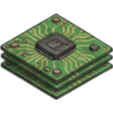
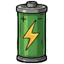
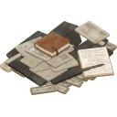

--- 
title: "Malfunctioning Sensor"
---

# Item: [[Items/Unknown/malfunctioning_sensor|Malfunctioning Sensor]]

![[assets/items/malfunctioning_sensor.png|150]]

Faulty detection unit. Electronics inside may be recoverable.

## Where to Find
- **[[Biomes/electronic_lab|Electronic Lab]]**: 4.2% drop chance
- **[[Biomes/industrial|Industrial]]**: 1.4% drop chance
- **[[Biomes/hidden_vault|Hidden Vault]]**: 1.6% drop chance
- **[[Biomes/desert|Desert]]**: 0.3% drop chance
## Combinations
### Used To Craft
**Workshop ([[Base/Constructions/assembly_bench|Assembly Bench]])**
- 1x [[Items/Unknown/malfunctioning_sensor|Malfunctioning Sensor]] + 1x [[Items/Unknown/micro_fuse|Micro Fuse]] + 1x [[Items/Unknown/circuit_boards|Circuit Boards]] → 1x [[Items/Unknown/calibrated_sensor|Calibrated Sensor]]

## Usage
Faulty detection unit. Electronics inside may be recoverable.

### Deconstruction (Salvage)
*  [[Items/Unknown/circuit_boards|Circuit Boards]] (40%)
*  [[Items/Unknown/battery|Battery]] (30%)
*  [[Items/Unknown/research_material|Research Material]] (rare, 10%)

## Required For
### Objectives
- [[Objectives/story_daily_relay_sensor_sweep|Relay Sensor Sweep]] (2x)
- [[Objectives/story_daily_electronics_recovery_contract|Electronics Recovery Contract]] (2x)
- [[Objectives/story_restore_command_channel|Restore the Command Channel]] (1x)
- [[Objectives/story_recover_field_intel|Recover Field Intel]] (1x)
- [[Objectives/story_manual_override_kit|Assemble Manual Override Kit]] (1x)

## Technical Information
- **Item ID**: `malfunctioning_sensor`
- **Rarity**: Rare
- **Asset ID**: `malfunctioning_sensor`
- **Asset Path**: `assets/items/malfunctioning_sensor.png`
