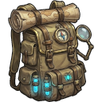

--- 
title: "Salvaged Fabric"
---

# Item: [[Items/Unknown/salvaged_fabric|Salvaged Fabric]]

![[assets/items/salvaged_fabric.png|150]]

Weathered cloth strips and tarp fibers useful for patching gear.

## Where to Find
- **[[Biomes/ruined_city|Ruined City]]**: 2.8% drop chance
- **[[Biomes/farm_facility|Farm Facility]]**: 3.6% drop chance
- **[[Biomes/desert|Desert]]**: 4.4% drop chance
- **[[Biomes/industrial|Industrial]]**: 0.8% drop chance
- **[[Biomes/forest|Forest]]**: 1.6% drop chance
- **[[Biomes/mountain|Mountain]]**: 1.6% drop chance
- **[[Biomes/oasis|Oasis]]**: 1.6% drop chance
- **[[Biomes/electronic_lab|Electronic Lab]]**: 0.4% drop chance
- **[[Biomes/hidden_vault|Hidden Vault]]**: 0.3% drop chance
## Combinations
### Used To Craft
**Workshop ([[Base/Constructions/assembly_bench|Assembly Bench]])**
- 1x [[Items/Unknown/worn_leather_pack|Worn Leather Pack]] + 1x [[Items/Unknown/salvaged_fabric|Salvaged Fabric]] + 1x [[Items/Unknown/rusted_chain|Rusted Chain]] → 1x [[Items/Unknown/salvager_pack|Salvager Pack]]
- 1x [[Items/Unknown/salvager_pack|Salvager Pack]] + 1x [[Items/Unknown/salvaged_fabric|Salvaged Fabric]] + 2x [[Items/Unknown/rusted_chain|Rusted Chain]] → 1x [[Items/Unknown/expedition_pack|Expedition Pack]]
- 1x [[Items/Unknown/expedition_pack|Expedition Pack]] + 2x [[Items/Unknown/salvaged_fabric|Salvaged Fabric]] + 2x [[Items/Unknown/filter_mesh|Filter Mesh]] → 1x [[Items/Unknown/hauler_pack|Hauler Pack]]

**Field**
- 1x [[Items/Unknown/salvaged_fabric|Salvaged Fabric]] + 1x [[Items/Unknown/bio_resin|Bio Resin]] → 1x [[Items/Medical/field_bandage|Field Bandage]]
- 1x [[Items/Unknown/salvaged_fabric|Salvaged Fabric]] + 1x [[Items/Medical/bottle_of_alcohol|Bottle of Alcohol]] → 1x [[Items/Medical/field_bandage|Field Bandage]]

## Usage

### Used in Recipes
*  [[Items/Unknown/salvager_pack|Salvager Pack]]
*  [[Items/Unknown/expedition_pack|Expedition Pack]]
*  [[Items/Unknown/hauler_pack|Hauler Pack]]

## Required For
### Objectives
- [[Objectives/story_daily_field_triage_drill|Field Triage Drill]] (2x)

## Technical Information
- **Item ID**: `salvaged_fabric`
- **Rarity**: Common

- **Asset ID**: `salvaged_fabric`
- **Asset Path**: `assets/items/salvaged_fabric.png`
