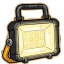

# Battery

![[assets/items/battery.png|150]]

### Core Properties
- **Rarity**: common
- **Category**: Material
- **Description**: 

## Usage
- Crafting  [[Items/lamp_functioning|Functioning Lamp]]

## Obtained From Deconstruction
> **Note**: Retrieval chance is affected by the source item's yield probability and your **[[Skills/salvage|Salvage]]** skill level.

- From  [[Items/lamp_functioning|Functioning Lamp]]: **30%** base chance.
- From  [[Items/malfunctioning_sensor|Malfunctioning Sensor]]: **30%** base chance.
- From  [[Items/broken_radio|Broken Radio]]: **20%** base chance.

## Biome Probabilities (Absolute %)
| Biome | % Per Hour |
| :--- | :--- |
| [[Biomes/electronic_lab|Electronic Store - Lab]] | 8.2% |
| [[Biomes/desert|Desert - Sand]] | 3.1% |
| [[Biomes/industrial|Industrial Zone]] | 3.0% |
| [[Biomes/farm_facility|Human Farm Facility]] | 2.9% |
| [[Biomes/forest|Forest]] | 2.4% |
| [[Biomes/hidden_vault|Hidden Vault]] | 2.1% |
| [[Biomes/ruined_city|Ruined City]] | 0.6% |

## Technical Information
- **Asset ID**: `battery`
- **Asset Path**: `items/battery.png`