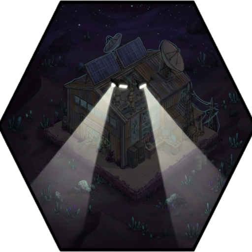

--- 
title: "Filter Mesh"
---

# Item: [[Items/filter_mesh|Filter Mesh]]

![[assets/items/filter_mesh.png|150]]

Fine wire mesh from masks and vents; still usable for filtration rigs.

## Where to Find
- ** [[Biomes/industrial|Industrial Zone]]** (8.6%)
- ** [[Biomes/electronic_lab|Electronic Store / Lab]]** (5.7%)
- ** [[Biomes/ruined_city|Ruined City]]** (4.8%)
- ** [[Biomes/farm_facility|Human Farm Facility]]** (4.3%)
- ** [[Biomes/hidden_vault|Hidden Vault]]** (2.4%)
- ** [[Biomes/desert|Desert / Sand]]** (1.4%)
- ** [[Biomes/forest|Forest]]** (1.0%)
- ** [[Biomes/mountain|Mountain / Quarry]]** (1.0%)
- ** [[Biomes/oasis|Oasis]]** (0.5%)

## Usage
### Crafting
* Used to craft  [[Items/salvager_pack|Salvager Pack]]
* Used to craft  [[Items/hauler_pack|Hauler Pack]]

## Technical Information
- **Asset ID**: `filter_mesh`
- **Asset Path**: `items/filter_mesh.png`
