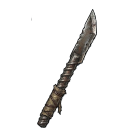

--- 
title: "Fortified Rebar"
---

# Item: [[Items/fortified_rebar|Fortified Rebar]]

![[assets/items/fortified_rebar.png|150]]

Bent but sturdy steel rods bundled for emergency fortifications.

## Where to Find
- **[[Biomes/ruined_city|Ruined City]]**: 1.9%
- **[[Biomes/industrial|Industrial]]**: 1.1%
- **[[Biomes/forest|Forest]]**: 0.7%
- **[[Biomes/desert|Desert]]**: 0.5%
- **[[Biomes/mountain|Mountain]]**: 0.4%
- **[[Biomes/electronic_lab|Electronic Lab]]**: 0.2%
- **[[Biomes/farm_facility|Farm Facility]]**: 0.3%
- **[[Biomes/oasis|Oasis]]**: 0.3%
## Combinations
### Crafted From
**Field Crafting (Any Tile)**
- 5x [[Items/scrap_metal|Scrap Metal]] → 1x [[Items/fortified_rebar|Fortified Rebar]]

### Used To Craft
**Base Facility ([[Builds/assembly_bench|Assembly Bench]])**
- 1x [[Items/scrap_spear|Scrap Spear]] + 1x [[Items/fortified_rebar|Fortified Rebar]] + 2x [[Items/ceramic_shards|Ceramic Shards]] → 1x [[Items/rebar_blade|Rebar Blade]]

## Usage
### Construction
- Required for [[Base/constructions#SpikeTrench|Spike Trench]]
- Required for [[Base/constructions#PalisadeWall|Timber Palisade Wall]]

### Used in Recipes
*  [[Items/rebar_blade|Rebar Blade]]

## Required For
### Base Facilities
- [[Builds/spike_trench|Spike Trench]] (4x)
- [[Builds/palisade_wall|Timber Palisade Wall]] (6x)
### Command Objectives
- [[Objectives/story_last_chance_fortify|Last-Chance Fortify]] (2x)

## Technical Information
- **Item ID**: `fortified_rebar`
- **Rarity**: Common

- **Asset ID**: `fortified_rebar`
- **Asset Path**: `items/fortified_rebar.png`
