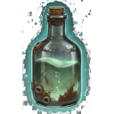
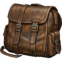

--- 
title: "Glowing Mushroom"
---

# Item: [[Items/glowing_mushroom|Glowing Mushroom]]

![[assets/items/glowing_mushroom.png|150]]

### Consumable Stats
- **Hunger**: -10
- **AP**: 1

## Where to Find
- **[[Biomes/forest|Forest]]**: 9.0%
- **[[Biomes/hidden_vault|Hidden Vault]]**: 4.8%
- **[[Biomes/oasis|Oasis]]**: 9.5%
- **[[Biomes/ruined_city|Ruined City]]**: 1.4%
- **[[Biomes/industrial|Industrial]]**: 1.0%
- **[[Biomes/desert|Desert]]**: 2.2%
- **[[Biomes/mountain|Mountain]]**: 1.0%
- **[[Biomes/electronic_lab|Electronic Lab]]**: 0.1%
## Combinations
### Used To Craft
- 1x [[Items/old_glass_bottle|Old Glass Bottle]] + 1x [[Items/glowing_mushroom|Glowing Mushroom]] → 1x [[Items/glowing_bottle|Glowing Bottle]]

## Usage

### Used in Recipes
*  [[Items/glowing_bottle|Glowing Bottle]]

### Yielded From Salvage
*  [[Items/glowing_bottle|Glowing Bottle]]
*  [[Items/worn_leather_pack|Worn Leather Pack]]

## Technical Information
- **Item ID**: `glowing_mushroom`
- **Rarity**: Common

- **Asset ID**: `glowing_mushroom`
- **Asset Path**: `items/glowing_mushroom.png`
