# [[Items/index|Item Directory]]

Complete database of all discoverable and craftable items in Hex Survival.

## 📦 Logistic & Storage
*    **[[Items/drone|Cargo Drone]]** (Mythic) - Autonomous field-to-base courier.
*    **[[Items/salvager_pack|Salvager Pack]]** (Rare) - +2 inventory slots.
*    **[[Items/expedition_pack|Expedition Pack]]** (Rare) - +3 inventory slots.
*    **[[Items/hauler_pack|Hauler Pack]]** (Mythic) - +4 inventory slots.
*    **[[Items/worn_leather_pack|Worn Leather Pack]]** (Common) - Scrap yield.

## 🧱 Defense & Construction
*    **[[Items/fortified_rebar|Fortified Rebar]]** (Common) - Structural reinforcement.
*   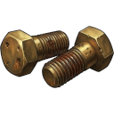 **[[Items/quarry_bolts|Quarry Bolts]]** (Common) - Anchor bolts.
*    **[[Items/ballistic_mesh|Ballistic Mesh]]** (Rare) - Impact absorption.
*    **[[Items/ceramic_armor_tile|Ceramic Armor Tile]]** (Rare) - Military-grade plating.
*   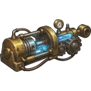 **[[Items/hardened_actuator|Hardened Actuator]]** (Rare) - Mechanical driver.
*    **[[Items/shock_capacitor|Shock Capacitor]]** (Rare) - High-energy storage.
*    **[[Items/targeting_relay|Targeting Relay]]** (Rare) - Fire-control module.
*    **[[Items/threat_sensor_array|Threat Sensor Array]]** (Rare) - Detection system.
*    **[[Items/bio_spike_pod|Bio Spike Pod]]** (Rare) - Living trap component.
*    **[[Items/resin_sealant|Resin Sealant]]** (Common) - Weatherproof coating.
*    **[[Items/scrap_metal|Scrap Metal]]** (Common) - Base building material.
*   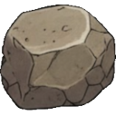 **[[Items/stone|Hardened Stone]]** (Common) - Heavy construction.
*    **[[Items/timber|Raw Timber]]** (Common) - Wood structures.
*   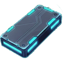 **[[Items/alloy_plate|Alloy Plate]]** (Rare) - High-tier reinforcement.
*    **[[Items/hydraulic_piston|Hydraulic Piston]]** (Rare) - Heavy gates.

## ⚡ Energy & Electronics
*    **[[Items/battery|Battery]]** (Common) - Portable power.
*    **[[Items/car_battery|Car Battery]]** (Common) - Base power storage.
*    **[[Items/solar_cell|Solar Cell]]** (Rare) - Renewable energy.
*   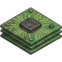 **[[Items/circuit_boards|Circuit Boards]]** (Rare) - Advanced electronics.
*    **[[Items/copper_wiring|Copper Wiring]]** (Common) - Electrical connections.
*    **[[Items/logic_core|Logic Core]]** (Rare) - Computing module.
*    **[[Items/signal_emitter|Signal Emitter]]** (Rare) - Transmission hardware.
*    **[[Items/capacitor_bank|Capacitor Bank]]** (Rare) - Energy buffering.
*    **[[Items/micro_fuse|Micro Fuse]]** (Rare) - Circuit protection.

## 🔥 Fuel & Power
*   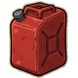 **[[Items/gasoline_canister|Gasoline Canister]]** (Rare) - 25% Power refill.
*    **[[Items/biofuel_cell|Biofuel Cell]]** (Rare) - 40% Power refill.
*    **[[Items/plasma_fuel_rod|Plasma Fuel Rod]]** (Mythic) - 60% Power refill.

## 🩸 Vitals & Survival
*    **[[Items/rations|Rations]]** (Common) - -30 Hunger.
*   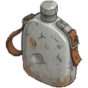 **[[Items/water|Clean Water]]** (Common) - -30 Thirst.
*    **[[Items/salad|Salad]]** (Common) - -20 Hunger.
*    **[[Items/stim_pack|Stim Pack]]** (Common) - +2 AP.
*    **[[Items/stim_injector|Stim Injector]]** (Rare) - +4 AP.
*    **[[Items/stim_overdrive|Stim Overdrive]]** (Mythic) - +6 AP.

## 🔦 Light Sources
*    **[[Items/starter_lamp|Starter Lamp]]** (Common) - 2 days light.
*   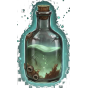 **[[Items/glowing_bottle|Glowing Bottle]]** (Common) - 2 days light.
*    **[[Items/lamp_functioning|Functioning Lamp]]** (Rare) - 5 days light.

## 🛠️ Tools & Equipment
*   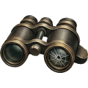 **[[Items/restored_binoculars|Restored Binoculars]]** (Rare) - Reveal adjacent biomes.
*    **[[Items/power_pole|Power Pole]]** (Common) - Deployable light relay.

## 🧪 Materials & Salvage
*    **[[Items/research_material|Research Material]]** (Rare) - Required for Lab projects.
*   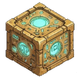 **[[Items/ancient_relic|Ancient Relic]]** (Mythic) - Rare pre-collapse artifact.
*    **[[Items/chemical_sludge|Chemical Sludge]]** (Rare) - Fuel refinery component.
*    **[[Items/bio_resin|Bio Resin]]** (Common) - Organic adhesive.
*    **[[Items/fungal_spores|Fungal Spores]]** (Common) - Bioluminescent spores.
*   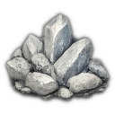 **[[Items/salt_crystals|Salt Crystals]]** (Common) - Mineral deposits.
*   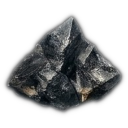 **[[Items/obsidian_flake|Obsidian Flake]]** (Rare) - Sharp glass.
*    **[[Items/salvaged_fabric|Salvaged Fabric]]** (Common) - Gear repair.
*   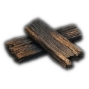 **[[Items/charred_planks|Charred Planks]]** (Common) - Burnt wood.
*    **[[Items/ceramic_shards|Ceramic Shards]]** (Common) - Insulation material.
*    **[[Items/rusted_chain|Rusted Chain]]** (Common) - Heavy binding.
*    **[[Items/filter_mesh|Filter Mesh]]** (Common) - Filtration material.
