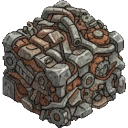

--- 
title: "Ruined Generator Parts"
---

# Item: [[Items/ruined_generator_parts|Ruined Generator Parts]]

![[assets/items/ruined_generator_parts.png|150]]

Scorched generator internals. Mixed scrap and chemicals.

## Where to Find
- **[[Biomes/industrial|Industrial]]**: 2.8% drop chance
- **[[Biomes/ruined_city|Ruined City]]**: 2.4% drop chance
- **[[Biomes/electronic_lab|Electronic Lab]]**: 2.3% drop chance
## Usage
Scorched generator internals. Mixed scrap and chemicals.

### Deconstruction (Salvage)
*  [[Items/scrap_metal|Scrap Metal]] (50%)
*  [[Items/copper_wiring|Copper Wiring]] (30%)
*  [[Items/chemical_sludge|Chemical Sludge]] (20%)
*  [[Items/circuit_boards|Circuit Boards]] (rare, 6%)

## Required For
### Objectives
- [[Objectives/story_stabilize_generators|Stabilize the Generators]] (2x)

## Technical Information
- **Item ID**: `ruined_generator_parts`
- **Rarity**: Common
- **Asset ID**: `ruined_generator_parts`
- **Asset Path**: `items/ruined_generator_parts.png`
