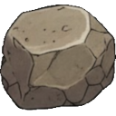

--- 
title: "Rusty Tool"
---

# Item: [[Items/rusty_tool|Rusty Tool]]

![[assets/items/rusty_tool.png|150]]

Corroded metal tool. Can be broken down for raw materials. Weapon: deals 1 monster damage per use with 35% break chance.

## Where to Find
- **[[Biomes/ruined_city|Ruined City]]**: 2.1% drop chance
- **[[Biomes/industrial|Industrial]]**: 1.5% drop chance
- **[[Biomes/desert|Desert]]**: 2.7% drop chance
- **[[Biomes/forest|Forest]]**: 1.1% drop chance
## Usage
Corroded metal tool. Can be broken down for raw materials. Weapon: deals 1 monster damage per use with 35% break chance.
### Weapon Stats
- **Damage**: 1
- **Break Chance**: 35%

### Deconstruction (Salvage)
*  [[Items/scrap_metal|Scrap Metal]] (60%)
*  [[Items/stone|Hardened Stone]] (20%)

## Required For
### Base Facilities
- [[Builds/assembly_bench|Assembly Bench]] (4x)

## Technical Information
- **Item ID**: `rusty_tool`
- **Rarity**: Common
- **Category**: Weapon
- **Asset ID**: `rusty_tool`
- **Asset Path**: `items/rusty_tool.png`
