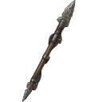

--- 
title: "Scrap Metal"
---

# Item: [[Items/scrap_metal|Scrap Metal]]

![[assets/items/scrap_metal.png|150]]

## Where to Find
- **[[Biomes/ruined_city|Ruined City]]**: 8.7%
- **[[Biomes/industrial|Industrial]]**: 5.0%
- **[[Biomes/farm_facility|Farm Facility]]**: 4.4%
- **[[Biomes/electronic_lab|Electronic Lab]]**: 2.1%
- **[[Biomes/desert|Desert]]**: 4.5%
- **[[Biomes/mountain|Mountain]]**: 2.3%
- **[[Biomes/hidden_vault|Hidden Vault]]**: 1.2%
- **[[Biomes/forest|Forest]]**: 0.9%
## Usage
### Construction
- Required for [[Base/constructions#BarbedWire|Barbed Wire Perimeter]]
- Required for [[Base/constructions#ReinforcedBulkhead|Reinforced Steel Bulkhead]]
- Required for [[Base/constructions#ScrapWorkshop|Scrap Workshop]]
- Required for [[Base/constructions#SignalBooster|Signal Booster (Radar)]]
- Required for [[Base/constructions#HydroponicPatch|Hydroponic Patch]]
- Required for [[Base/constructions#SentryTurret|Automated Sentry]]
- Required for [[Base/constructions#SolarPanels|Solar Panels]]
- Required for [[Base/constructions#ResearchLab|Research Lab]]
- Required for [[Base/constructions#ResearchLabIi|Research Lab II]]
- Required for [[Base/constructions#BatteryBank|Battery Storage]]
- Required for [[Base/constructions#BeaconAmplifier|Beacon Amplifier]]
- Required for [[Base/constructions#FuelRefinery|Fuel Refinery]]
- Required for  [[Base/constructions#PowerPole|Power Pole]]
- Required for [[Base/constructions#ScrapBarricade|Scrap Barricade Wall]]
- Required for [[Base/constructions#AutoBoltNest|Auto-Bolt Nest]]

### Used in Recipes
*  [[Items/solar_cell|Solar Cell]]
*  [[Items/power_pole|Power Pole]]
*  [[Items/scrap_spear|Scrap Spear]]

### Yielded From Salvage
*  [[Items/lamp_empty|Lamp (empty)]]
*  [[Items/gasoline_generator|Gasoline Generator]]
*  [[Items/solar_cell|Solar Cell]]
*  [[Items/power_pole|Power Pole]]
*  [[Items/broken_radio|Broken Radio]]
*  [[Items/rusty_tool|Rusty Tool]]
*  [[Items/cracked_lens|Cracked Lens]]
*  [[Items/burnt_motor|Burnt-Out Motor]]
*  [[Items/empty_canister|Empty Canister]]
*  [[Items/worn_leather_pack|Worn Leather Pack]]
*  [[Items/broken_binoculars|Broken Binoculars]]
*  [[Items/ruined_generator_parts|Ruined Generator Parts]]
*  [[Items/damaged_solar_panel|Damaged Solar Panel]]

## Technical Information
- **Item ID**: `scrap_metal`
- **Rarity**: Common

- **Asset ID**: `scrap_metal`
- **Asset Path**: `items/scrap_metal.png`
