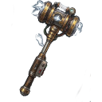

--- 
title: "Shock Capacitor"
---

# Item: [[Items/shock_capacitor|Shock Capacitor]]

![[assets/items/shock_capacitor.png|150]]

Charge-dense capacitor produced by powered Industrial facilities for perimeter shock grids.

### Requirements
- **Skill**: [[Skills/field_engineering|Field Engineering]] (Level 2)

## Production
Produced by Industrial facilities Biome

## Where to Find
- *Cannot be found in the wilderness (Crafting/Production only).*
## Combinations
### Used To Craft
**Workshop ([[Builds/assembly_bench|Assembly Bench]])**
- 1x [[Items/rebar_blade|Rebar Blade]] + 1x [[Items/shock_capacitor|Shock Capacitor]] + 1x [[Items/hardened_actuator|Hardened Actuator]] → 1x [[Items/shock_maul|Shock Maul]]

## Usage
### Construction
- Required for [[Builds/shock_fence_grid|Shock Fence Grid]]
- Required for [[Builds/counterbattery_array|Counterbattery Array]]
- Required for [[Builds/citadel_aegis|Citadel Aegis Core]]

### Used in Recipes
*  [[Items/shock_maul|Shock Maul]]

## Required For
### Base Facilities
- [[Builds/shock_fence_grid|Shock Fence Grid]] (4x)
- [[Builds/counterbattery_array|Counterbattery Array]] (6x)
- [[Builds/citadel_aegis|Citadel Aegis Core]] (6x)

## Technical Information
- **Item ID**: `shock_capacitor`
- **Rarity**: Rare
- **Skill Requirement**: [[Skills/field_engineering|Field Engineering]] (Level 2)
- **Requirement**: Field Engineering Level 2

- **Asset ID**: `shock_capacitor`
- **Asset Path**: `items/shock_capacitor.png`
