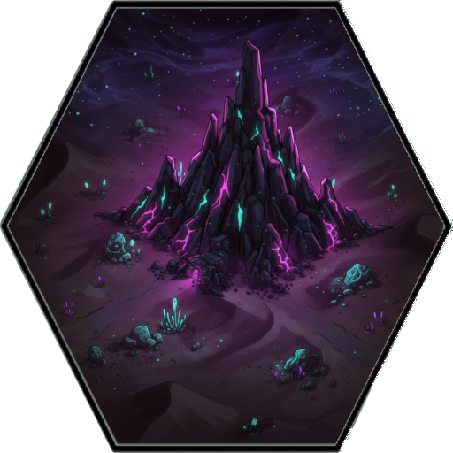
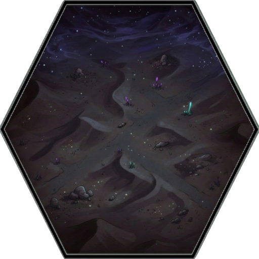
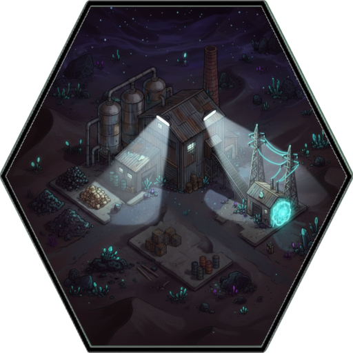
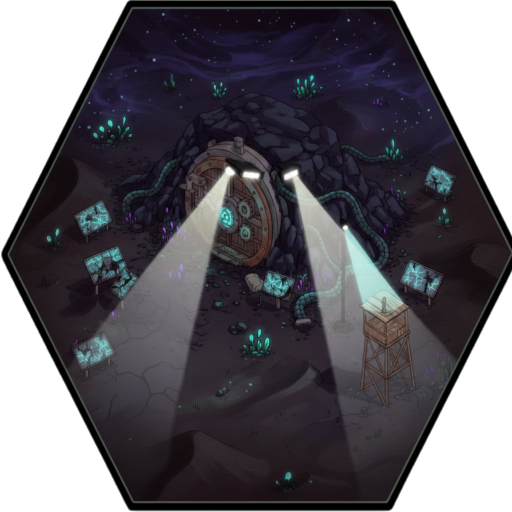
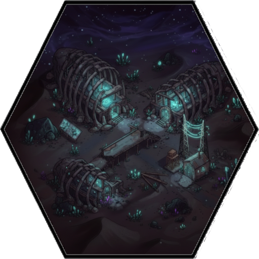
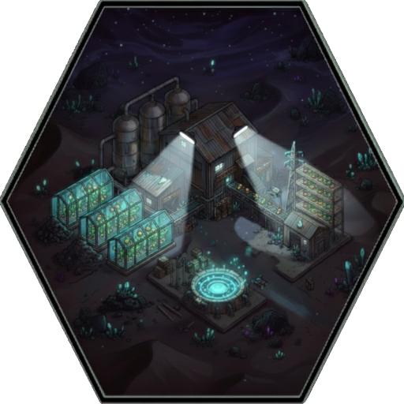
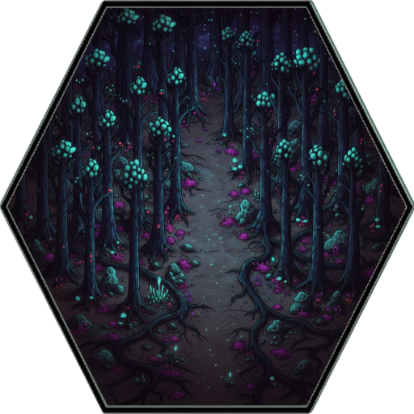
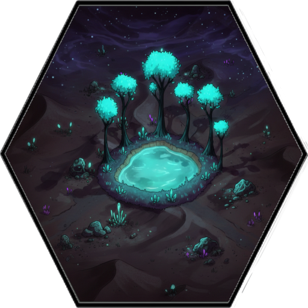

--- 
title: "Hardened Stone"
---

# Item: [[Items/stone|Hardened Stone]]

![[assets/items/stone.png|150]]

## Where to Find
- ** [[Biomes/mountain|Mountain / Quarry]]** (21.4%)
- ** [[Biomes/desert|Desert / Sand]]** (16.6%)
- ** [[Biomes/industrial|Industrial Zone]]** (5.9%)
- ** [[Biomes/hidden_vault|Hidden Vault]]** (3.6%)
- ** [[Biomes/ruined_city|Ruined City]]** (3.6%)
- ** [[Biomes/farm_facility|Human Farm Facility]]** (3.3%)
- ** [[Biomes/forest|Forest]]** (2.4%)
- ** [[Biomes/oasis|Oasis]]** (1.2%)

## Usage
### Construction
- Required for [[Base/constructions#ReinforcedBulkhead|Reinforced Steel Bulkhead]]
- Required for [[Base/constructions#Watchtower|Watchtower]]
- Required for [[Base/constructions#HydroponicPatch|Hydroponic Patch]]
- Required for [[Base/constructions#Well|Well]]
- Required for [[Base/constructions#FuelRefinery|Fuel Refinery]]
- Required for [[Base/constructions#SpikeTrench|Spike Trench]]
- Required for [[Base/constructions#PalisadeWall|Timber Palisade Wall]]

### Yielded From Salvage
*  [[Items/rusty_tool|Rusty Tool]]

## Technical Information
- **Item ID**: `stone`
- **Rarity**: Common

- **Asset ID**: `stone`
- **Asset Path**: `items/stone.png`
