# Mechanism: Crafting and Recipes

## Recipe Book View
The **Recipe Book** is a dedicated interface for managing all known combinations and crafting workflows. It provides a centralized location to view required materials and the current availability of resources within the player's inventory or the town's shared storage.

## User Interface & Layout
- **Recipe-Row Improvements**: Each recipe entry features enhanced icons and a cleaner layout for improved readability.
- **Relocated Logistics**: For smoother item management, the **Deposit**, **Deliver** (via drone), and **Drop-All** actions have been repositioned to more intuitive locations within the crafting and inventory menus.

## Known Recipes (Combinations)

| Output | Inputs | Requirement |
| :--- | :--- | :--- |
| 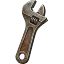 [[Items/makeshift_rod|Makeshift Rod]] | 1&nbsp;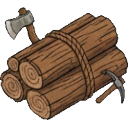&nbsp;[[Items/timber|Timber]] 1&nbsp;&nbsp;[[Items/scrap_metal|Scrap&nbsp;Metal]] 1&nbsp;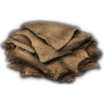&nbsp;[[Items/fishing_line|Fishing&nbsp;Line]] | None |
|  [[Items/timber|Raw Timber]] | 1&nbsp;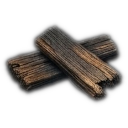&nbsp;[[Items/charred_planks|Charred&nbsp;Planks]] | None |
| 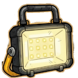 [[Items/lamp_functioning|Functioning Lamp]] | 1&nbsp;&nbsp;[[Items/battery|Battery]] 1&nbsp;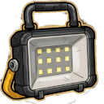&nbsp;[[Items/lamp_empty|Lamp&nbsp;Empty]] | None |
|  [[Items/glowing_bottle|Glowing Bottle]] | 1&nbsp;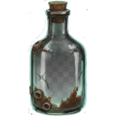&nbsp;[[Items/old_glass_bottle|Old&nbsp;Glass&nbsp;Bottle]] 1&nbsp;&nbsp;[[Items/glowing_mushroom|Glowing&nbsp;Mushroom]] | None |
| 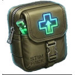 [[Items/stim_pack|Stim Pack]] | 1&nbsp;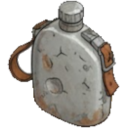&nbsp;[[Items/water|Water]] 1&nbsp;&nbsp;[[Items/fungal_spores|Fungal&nbsp;Spores]] 1&nbsp;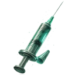&nbsp;[[Items/sterile_syringe|Sterile&nbsp;Syringe]] | None |
| 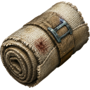 [[Items/field_bandage|Field Bandage]] | 1&nbsp;&nbsp;[[Items/salvaged_fabric|Salvaged&nbsp;Fabric]] 1&nbsp;&nbsp;[[Items/bio_resin|Bio&nbsp;Resin]] | None |
|  [[Items/field_bandage|Field Bandage]] | 1&nbsp;&nbsp;[[Items/salvaged_fabric|Salvaged&nbsp;Fabric]] 1&nbsp;&nbsp;[[Items/bottle_of_alcohol|Bottle&nbsp;Of&nbsp;Alcohol]] | None |
| 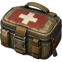 [[Items/first_aid_kit|First Aid Kit]] | 1&nbsp;&nbsp;[[Items/field_bandage|Field&nbsp;Bandage]] 1&nbsp;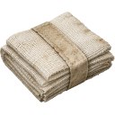&nbsp;[[Items/med_gauze|Med&nbsp;Gauze]] 1&nbsp;&nbsp;[[Items/water|Water]] | None |
| 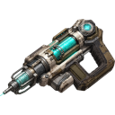 [[Items/trauma_stabilizer|Trauma Stabilizer]] | 1&nbsp;&nbsp;[[Items/first_aid_kit|First&nbsp;Aid&nbsp;Kit]] 1&nbsp;&nbsp;[[Items/sterile_syringe|Sterile&nbsp;Syringe]] 1&nbsp;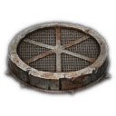&nbsp;[[Items/filter_mesh|Filter&nbsp;Mesh]] | None |
| 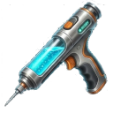 [[Items/stim_injector|Stim Injector]] | 1&nbsp;&nbsp;[[Items/stim_pack|Stim&nbsp;Pack]] 1&nbsp;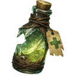&nbsp;[[Items/stimulant_reagent|Stimulant&nbsp;Reagent]] 1&nbsp;&nbsp;[[Items/sterile_syringe|Sterile&nbsp;Syringe]] | None |
| 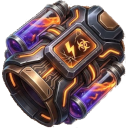 [[Items/stim_overdrive|Stim Overdrive]] | 1&nbsp;&nbsp;[[Items/stim_injector|Stim&nbsp;Injector]] 1&nbsp;&nbsp;[[Items/chemical_sludge|Chemical&nbsp;Sludge]] 1&nbsp;&nbsp;[[Items/cryo_flask|Cryo&nbsp;Flask]] | None |
| 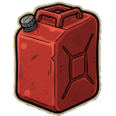 [[Items/gasoline_canister|Gasoline Canister]] | 2&nbsp;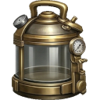&nbsp;[[Items/empty_canister|Empty&nbsp;Canister]] 1&nbsp;&nbsp;[[Items/chemical_sludge|Chemical&nbsp;Sludge]] | None |
|  [[Items/gasoline_generator|Gasoline Generator]] | 1&nbsp;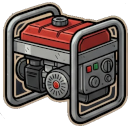&nbsp;[[Items/gasoline_generator_empty|Gasoline&nbsp;Generator&nbsp;Empty]] 1&nbsp;&nbsp;[[Items/gasoline_canister|Gasoline&nbsp;Canister]] | None |
| 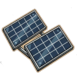 [[Items/solar_cell|Solar Cell]] | 2&nbsp;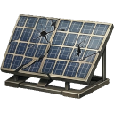&nbsp;[[Items/damaged_solar_panel|Damaged&nbsp;Solar&nbsp;Panel]] 2&nbsp;&nbsp;[[Items/copper_wiring|Copper&nbsp;Wiring]] | None |
|  [[Items/solar_cell|Solar Cell]] | 1&nbsp;&nbsp;[[Items/circuit_boards|Circuit&nbsp;Boards]] 2&nbsp;&nbsp;[[Items/copper_wiring|Copper&nbsp;Wiring]] 1&nbsp;&nbsp;[[Items/scrap_metal|Scrap&nbsp;Metal]] | None |
|  [[Items/field_radio|Field Radio]] | 1&nbsp;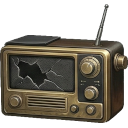&nbsp;[[Items/broken_radio|Broken&nbsp;Radio]] 1&nbsp;&nbsp;[[Items/copper_wiring|Copper&nbsp;Wiring]] 1&nbsp;&nbsp;[[Items/battery|Battery]] | None |
| 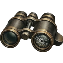 [[Items/restored_binoculars|Restored Binoculars]] | 1&nbsp;&nbsp;[[Items/broken_binoculars|Broken&nbsp;Binoculars]] 1&nbsp;&nbsp;[[Items/cracked_lens|Cracked&nbsp;Lens]] | None |
|  [[Items/calibrated_sensor|Calibrated Sensor]] | 1&nbsp;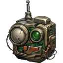&nbsp;[[Items/malfunctioning_sensor|Malfunctioning&nbsp;Sensor]] 1&nbsp;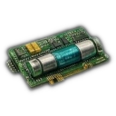&nbsp;[[Items/micro_fuse|Micro&nbsp;Fuse]] 1&nbsp;&nbsp;[[Items/circuit_boards|Circuit&nbsp;Boards]] | None |
|  [[Items/restored_binoculars|Restored Binoculars]] | 1&nbsp;&nbsp;[[Items/cracked_lens|Cracked&nbsp;Lens]] 1&nbsp;&nbsp;[[Items/old_glass_bottle|Old&nbsp;Glass&nbsp;Bottle]] | None |
| 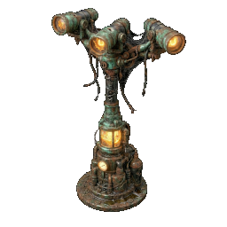 [[Items/power_pole|Power Pole]] | 1&nbsp;&nbsp;[[Items/copper_wiring|Copper&nbsp;Wiring]] 1&nbsp;&nbsp;[[Items/scrap_metal|Scrap&nbsp;Metal]] | None |
|  [[Items/fortified_rebar|Fortified Rebar]] | 5&nbsp;&nbsp;[[Items/scrap_metal|Scrap&nbsp;Metal]] | None |
| 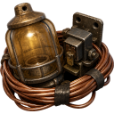 [[Items/pole_upgrade_kit|Pole Upgrade Kit]] | 1&nbsp;&nbsp;[[Items/lamp_empty|Lamp&nbsp;Empty]] 1&nbsp;&nbsp;[[Items/copper_wiring|Copper&nbsp;Wiring]] | None |
|  [[Items/salvager_pack|Salvager Pack]] | 1&nbsp;&nbsp;[[Items/worn_leather_pack|Worn&nbsp;Leather&nbsp;Pack]] 1&nbsp;&nbsp;[[Items/salvaged_fabric|Salvaged&nbsp;Fabric]] 1&nbsp;&nbsp;[[Items/rusted_chain|Rusted&nbsp;Chain]] | None |
|  [[Items/expedition_pack|Expedition Pack]] | 1&nbsp;&nbsp;[[Items/salvager_pack|Salvager&nbsp;Pack]] 1&nbsp;&nbsp;[[Items/salvaged_fabric|Salvaged&nbsp;Fabric]] 2&nbsp;&nbsp;[[Items/rusted_chain|Rusted&nbsp;Chain]] | None |
|  [[Items/hauler_pack|Hauler Pack]] | 1&nbsp;&nbsp;[[Items/expedition_pack|Expedition&nbsp;Pack]] 2&nbsp;&nbsp;[[Items/salvaged_fabric|Salvaged&nbsp;Fabric]] 2&nbsp;&nbsp;[[Items/filter_mesh|Filter&nbsp;Mesh]] | None |
| 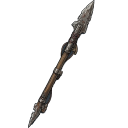 [[Items/scrap_spear|Scrap Spear]] | 1&nbsp;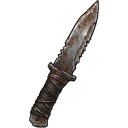&nbsp;[[Items/makeshift_shiv|Makeshift&nbsp;Shiv]] 1&nbsp;&nbsp;[[Items/timber|Timber]] 1&nbsp;&nbsp;[[Items/scrap_metal|Scrap&nbsp;Metal]] | None |
|  [[Items/rebar_blade|Rebar Blade]] | 1&nbsp;&nbsp;[[Items/scrap_spear|Scrap&nbsp;Spear]] 1&nbsp;&nbsp;[[Items/fortified_rebar|Fortified&nbsp;Rebar]] 2&nbsp;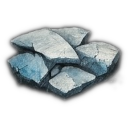&nbsp;[[Items/ceramic_shards|Ceramic&nbsp;Shards]] | None |
|  [[Items/shock_maul|Shock Maul]] | 1&nbsp;&nbsp;[[Items/rebar_blade|Rebar&nbsp;Blade]] 1&nbsp;&nbsp;[[Items/shock_capacitor|Shock&nbsp;Capacitor]] 1&nbsp;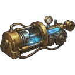&nbsp;[[Items/hardened_actuator|Hardened&nbsp;Actuator]] | None |
| 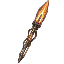 [[Items/plasma_lance|Plasma Lance]] | 1&nbsp;&nbsp;[[Items/shock_maul|Shock&nbsp;Maul]] 1&nbsp;&nbsp;[[Items/plasma_fuel_rod|Plasma&nbsp;Fuel&nbsp;Rod]] 1&nbsp;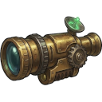&nbsp;[[Items/targeting_relay|Targeting&nbsp;Relay]] | None |
| 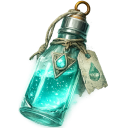 [[Items/cleanse_vial|Cleanse Vial]] | 1&nbsp;&nbsp;[[Items/water|Water]] 1&nbsp;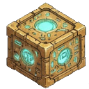&nbsp;[[Items/ancient_relic|Ancient&nbsp;Relic]] 1&nbsp;&nbsp;[[Items/chemical_sludge|Chemical&nbsp;Sludge]] 1&nbsp;&nbsp;[[Items/old_glass_bottle|Old&nbsp;Glass&nbsp;Bottle]] | None |
|  [[Items/vault_access_key|Vault Access Key]] | 3&nbsp;&nbsp;[[Items/vault_key_fragment|Vault&nbsp;Key&nbsp;Fragment]] | None |
|  [[Items/plasma_fuel_rod|Plasma Fuel Rod]] | 1&nbsp;&nbsp;[[Items/plasma_fuel_rod|Plasma&nbsp;Fuel&nbsp;Rod]] 1&nbsp;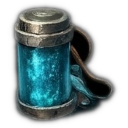&nbsp;[[Items/reactor_dust|Reactor&nbsp;Dust]] | None |
| 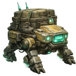 [[Items/hauler_drone|Fabrication Hauler Drone]] | 1&nbsp;&nbsp;[[Items/battery|Battery]] 1&nbsp;&nbsp;[[Items/circuit_boards|Circuit&nbsp;Boards]] 2&nbsp;&nbsp;[[Items/copper_wiring|Copper&nbsp;Wiring]] 2&nbsp;&nbsp;[[Items/scrap_metal|Scrap&nbsp;Metal]] | None |
| 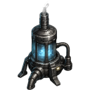 [[Items/humidity_extractor|Humidity Extractor]] | 1&nbsp;&nbsp;[[Items/filter_mesh|Filter&nbsp;Mesh]] 1&nbsp;&nbsp;[[Items/copper_wiring|Copper&nbsp;Wiring]] 2&nbsp;&nbsp;[[Items/scrap_metal|Scrap&nbsp;Metal]] 1&nbsp;&nbsp;[[Items/old_glass_bottle|Old&nbsp;Glass&nbsp;Bottle]] | None |

## Deconstruction (Salvage)

| Item | Primary Yield (Prob.) | Rare Bonus (Prob.) |
| :--- | :--- | :--- |
|  [[Items/fishing_line|Fishing Line]] | &nbsp;[[Items/salvaged_fabric|Salvaged&nbsp;Fabric]]&nbsp;(40%) | - |
|  [[Items/makeshift_rod|Makeshift Rod]] | &nbsp;[[Items/timber|Raw&nbsp;Timber]]&nbsp;(40%) &nbsp;[[Items/scrap_metal|Scrap&nbsp;Metal]]&nbsp;(25%) &nbsp;[[Items/fishing_line|Fishing&nbsp;Line]]&nbsp;(35%) | - |
| 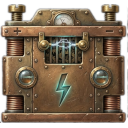 [[Items/car_battery|Car Battery]] | 2x&nbsp;&nbsp;[[Items/battery|Battery]]&nbsp;(100%) | - |
|  [[Items/lamp_empty|Lamp (empty)]] | &nbsp;[[Items/scrap_metal|Scrap&nbsp;Metal]]&nbsp;(40%) &nbsp;[[Items/copper_wiring|Copper&nbsp;Wiring]]&nbsp;(20%) | - |
|  [[Items/old_glass_bottle|Old Glass Bottle]] | 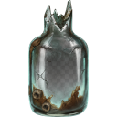&nbsp;[[Items/broken_glass_bottle|Broken&nbsp;Glass&nbsp;Bottle]]&nbsp;(100%) | - |
|  [[Items/glowing_bottle|Glowing Bottle]] | &nbsp;[[Items/old_glass_bottle|Old&nbsp;Glass&nbsp;Bottle]]&nbsp;(50%) &nbsp;[[Items/glowing_mushroom|Glowing&nbsp;Mushroom]]&nbsp;(30%) | - |
|  [[Items/lamp_functioning|Functioning Lamp]] | &nbsp;[[Items/lamp_empty|Lamp&nbsp;(empty)]]&nbsp;(60%) &nbsp;[[Items/battery|Battery]]&nbsp;(30%) | &nbsp;[[Items/copper_wiring|Copper&nbsp;Wiring]]&nbsp;(5%) |
|  [[Items/gasoline_generator|Gasoline Generator]] | &nbsp;[[Items/gasoline_generator_empty|Gasoline&nbsp;Generator&nbsp;(empty)]]&nbsp;(50%) &nbsp;[[Items/scrap_metal|Scrap&nbsp;Metal]]&nbsp;(40%) &nbsp;[[Items/copper_wiring|Copper&nbsp;Wiring]]&nbsp;(30%) | &nbsp;[[Items/circuit_boards|Circuit&nbsp;Boards]]&nbsp;(15%) |
|  [[Items/gasoline_generator_empty|Gasoline Generator (empty)]] | &nbsp;[[Items/scrap_metal|Scrap&nbsp;Metal]]&nbsp;(45%) &nbsp;[[Items/copper_wiring|Copper&nbsp;Wiring]]&nbsp;(35%) | &nbsp;[[Items/circuit_boards|Circuit&nbsp;Boards]]&nbsp;(22%) |
|  [[Items/solar_cell|Solar Cell]] | &nbsp;[[Items/circuit_boards|Circuit&nbsp;Boards]]&nbsp;(30%) &nbsp;[[Items/copper_wiring|Copper&nbsp;Wiring]]&nbsp;(50%) &nbsp;[[Items/scrap_metal|Scrap&nbsp;Metal]]&nbsp;(30%) | &nbsp;[[Items/research_material|Research&nbsp;Material]]&nbsp;(4%) |
|  [[Items/power_pole|Power Pole]] | &nbsp;[[Items/copper_wiring|Copper&nbsp;Wiring]]&nbsp;(50%) &nbsp;[[Items/scrap_metal|Scrap&nbsp;Metal]]&nbsp;(40%) | &nbsp;[[Items/circuit_boards|Circuit&nbsp;Boards]]&nbsp;(15%) |
|  [[Items/broken_radio|Broken Radio]] | &nbsp;[[Items/scrap_metal|Scrap&nbsp;Metal]]&nbsp;(50%) &nbsp;[[Items/copper_wiring|Copper&nbsp;Wiring]]&nbsp;(30%) &nbsp;[[Items/battery|Battery]]&nbsp;(20%) | &nbsp;[[Items/circuit_boards|Circuit&nbsp;Boards]]&nbsp;(28%) |
|  [[Items/rusty_tool|Rusty Tool]] | &nbsp;[[Items/scrap_metal|Scrap&nbsp;Metal]]&nbsp;(60%) &nbsp;[[Items/stone|Hardened&nbsp;Stone]]&nbsp;(20%) | - |
|  [[Items/cracked_lens|Cracked Lens]] | &nbsp;[[Items/scrap_metal|Scrap&nbsp;Metal]]&nbsp;(30%) | - |
| 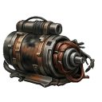 [[Items/burnt_motor|Burnt-Out Motor]] | &nbsp;[[Items/scrap_metal|Scrap&nbsp;Metal]]&nbsp;(50%) &nbsp;[[Items/copper_wiring|Copper&nbsp;Wiring]]&nbsp;(40%) | &nbsp;[[Items/chemical_sludge|Chemical&nbsp;Sludge]]&nbsp;(8%) &nbsp;[[Items/circuit_boards|Circuit&nbsp;Boards]]&nbsp;(20%) |
|  [[Items/empty_canister|Empty Canister]] | &nbsp;[[Items/scrap_metal|Scrap&nbsp;Metal]]&nbsp;(50%) | - |
|  [[Items/worn_leather_pack|Worn Leather Pack]] | &nbsp;[[Items/timber|Raw&nbsp;Timber]]&nbsp;(40%) &nbsp;[[Items/scrap_metal|Scrap&nbsp;Metal]]&nbsp;(20%) | &nbsp;[[Items/glowing_mushroom|Glowing&nbsp;Mushroom]]&nbsp;(5%) |
|  [[Items/broken_binoculars|Broken Binoculars]] | &nbsp;[[Items/old_glass_bottle|Old&nbsp;Glass&nbsp;Bottle]]&nbsp;(40%) &nbsp;[[Items/scrap_metal|Scrap&nbsp;Metal]]&nbsp;(40%) | - |
|  [[Items/field_radio|Field Radio]] | &nbsp;[[Items/broken_radio|Broken&nbsp;Radio]]&nbsp;(45%) &nbsp;[[Items/copper_wiring|Copper&nbsp;Wiring]]&nbsp;(35%) &nbsp;[[Items/battery|Battery]]&nbsp;(25%) | &nbsp;[[Items/circuit_boards|Circuit&nbsp;Boards]]&nbsp;(20%) |
|  [[Items/malfunctioning_sensor|Malfunctioning Sensor]] | &nbsp;[[Items/circuit_boards|Circuit&nbsp;Boards]]&nbsp;(40%) &nbsp;[[Items/battery|Battery]]&nbsp;(30%) | &nbsp;[[Items/research_material|Research&nbsp;Material]]&nbsp;(10%) |
|  [[Items/calibrated_sensor|Calibrated Sensor]] | &nbsp;[[Items/malfunctioning_sensor|Malfunctioning&nbsp;Sensor]]&nbsp;(45%) &nbsp;[[Items/battery|Battery]]&nbsp;(30%) | &nbsp;[[Items/circuit_boards|Circuit&nbsp;Boards]]&nbsp;(25%) |
| 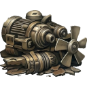 [[Items/ruined_generator_parts|Ruined Generator Parts]] | &nbsp;[[Items/scrap_metal|Scrap&nbsp;Metal]]&nbsp;(50%) &nbsp;[[Items/copper_wiring|Copper&nbsp;Wiring]]&nbsp;(30%) &nbsp;[[Items/chemical_sludge|Chemical&nbsp;Sludge]]&nbsp;(20%) | &nbsp;[[Items/circuit_boards|Circuit&nbsp;Boards]]&nbsp;(14%) |
|  [[Items/damaged_solar_panel|Damaged Solar Panel]] | &nbsp;[[Items/solar_cell|Solar&nbsp;Cell]]&nbsp;(30%) &nbsp;[[Items/copper_wiring|Copper&nbsp;Wiring]]&nbsp;(50%) &nbsp;[[Items/scrap_metal|Scrap&nbsp;Metal]]&nbsp;(30%) | &nbsp;[[Items/circuit_boards|Circuit&nbsp;Boards]]&nbsp;(20%) |
|  [[Items/bottle_of_alcohol|Bottle of Alcohol]] | &nbsp;[[Items/old_glass_bottle|Old&nbsp;Glass&nbsp;Bottle]]&nbsp;(55%) | - |
|  [[Items/ceramic_pot|Ceramic Pot]] | &nbsp;[[Items/ceramic_shards|Ceramic&nbsp;Shards]]&nbsp;(200%) | - |
| 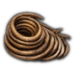 [[Items/thermal_coil|Thermal Coil]] | 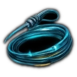&nbsp;[[Items/ionized_filament|Ionized&nbsp;Filament]]&nbsp;(35%) &nbsp;[[Items/copper_wiring|Copper&nbsp;Wiring]]&nbsp;(35%) &nbsp;[[Items/scrap_metal|Scrap&nbsp;Metal]]&nbsp;(20%) | &nbsp;[[Items/battery|Battery]]&nbsp;(12%) |
|  [[Items/hide_scrap|Hide Scrap]] | &nbsp;[[Items/salvaged_fabric|Salvaged&nbsp;Fabric]]&nbsp;(35%) | - |
|  [[Items/power_pole_mk2|Reinforced Power Pole]] | &nbsp;[[Items/power_pole|Power&nbsp;Pole]]&nbsp;(50%) &nbsp;[[Items/ionized_filament|Ionized&nbsp;Filament]]&nbsp;(25%) &nbsp;[[Items/logic_core|Logic&nbsp;Core]]&nbsp;(25%) &nbsp;[[Items/copper_wiring|Copper&nbsp;Wiring]]&nbsp;(40%) | &nbsp;[[Items/circuit_boards|Circuit&nbsp;Boards]]&nbsp;(22%) |
