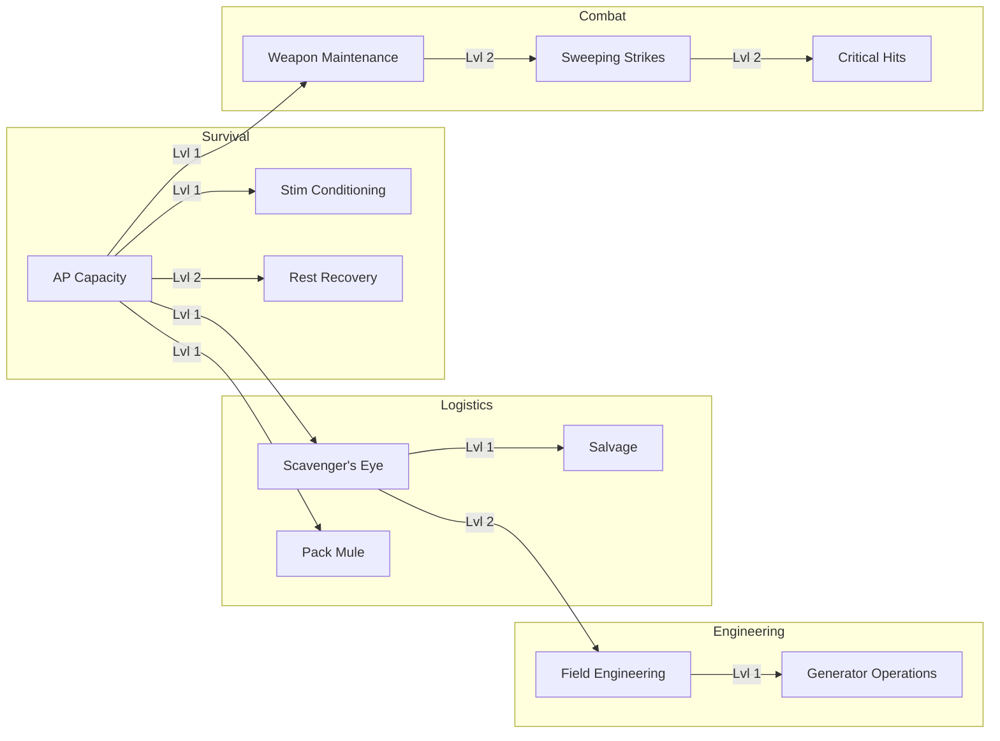

# Skill: [[Skills/index|Index]]

Skills are permanent character specializations that progress in real-time. Training a skill does not consume AP.

## 🔗 Skill Dependencies

## 🩸 Survival Skills
Primary skills for basic existence and movement.

| Skill | Effect |
| :--- | :--- |
| **[[Skills/ap_capacity|AP Capacity]]** | Increases max Action Points (+1 per level). |
| **[[Skills/rest_recovery|Rest Recovery]]** | Chance for +1 extra AP per hourly rest. |
| **[[Skills/stim_conditioning|Stim Conditioning]]** | Unlock the use of high-tier AP Stims. |

## 🔍 Scavenging & Logistics
Skills that improve resource acquisition and inventory.

| Skill | Effect |
| :--- | :--- |
| **[[Skills/scavenger_eye|Scavenger's Eye]]** | Increases loot success chance (+5% per level). |
| **[[Skills/pack_mule|Pack Mule]]** | Increases carried inventory slots (+1 per level). |
| **[[Skills/salvage|Salvage]]** | Enables deconstruction and improves resource yield. |

## ⚔️ Combat & Defense
Specializations for fighting monster hordes.

| Skill | Effect |
| :--- | :--- |
| **[[Skills/weapon_maintenance|Weapon Maintenance]]** | Reduces weapon break chance (-2% per level). |
| **[[Skills/sweeping_strikes|Sweeping Strikes]]** | Chance to kill 1 extra monster (5% per level). |
| **[[Skills/critical_hits|Critical Hits]]** | Chance for critical hit (kill 3 monsters). |

## 🏗️ Engineering & Operations
Advanced skills for town maintenance and facility fabrication.

| Skill | Effect |
| :--- | :--- |
| **[[Skills/field_engineering|Field Engineering]]** | Unlock fabrication in Industrial/Electronic biomes. |
| **[[Skills/generator_operations|Generator Operations]]** | Safely run/refuel town generators. |

## ⏳ Training Times
Training times are fixed real-world intervals.
- **Level 1**: 1 Hour
- **Level 2**: 24 Hours
- **Level 3**: 7 Days
- **Level 4**: 14 Days
- **Level 5**: 30 Days
