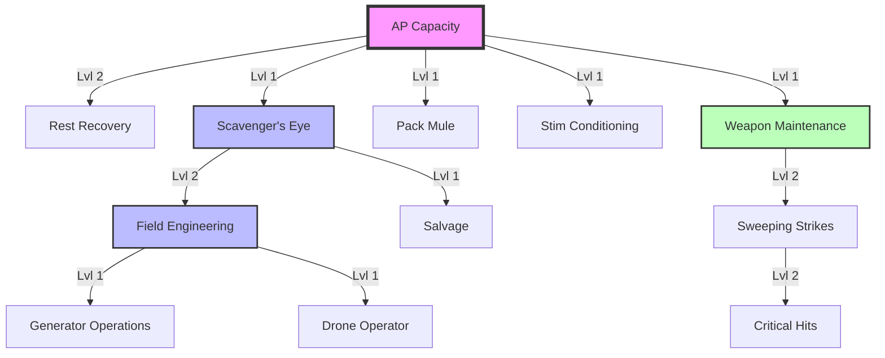

# [[Skills/index|Skill Tree]]

Character progression in Hex Survival is handled through real-time skill training.

## 🩸 Vitality & Recovery
*   **[[Skills/ap_capacity|AP Capacity]]**: +1 Max AP per level.
*   **[[Skills/rest_recovery|Rest Recovery]]**: Chance for bonus AP during rest.
*   **[[Skills/stim_conditioning|Stim Conditioning]]**: Unlocks use of Stim Packs, Injectors, and Overdrives.

## 🔍 Exploration & Scavenging
*   **[[Skills/scavenger_eye|Scavenger's Eye]]**: +5% loot find chance per level.
*   **[[Skills/pack_mule|Pack Mule]]**: +1 inventory slot per level.
*   **[[Skills/salvage|Salvage]]**: Unlocks deconstruction and improves resource yields.

## ⚙️ Engineering & Logistics
*   **[[Skills/field_engineering|Field Engineering]]**: Unlocks fabrication at industrial and electronic facilities.
*   **[[Skills/generator_operations|Generator Operations]]**: Required to refuel and manage town power.
*   **[[Skills/drone_operator|Drone Operator]]**: Unlocks the use of autonomous cargo drones.

## ⚔️ Combat & Maintenance
*   **[[Skills/weapon_maintenance|Weapon Maintenance]]**: Reduces weapon break chance.
*   **[[Skills/sweeping_strikes|Sweeping Strikes]]**: Chance to kill an extra monster per attack.
*   **[[Skills/critical_hits|Critical Hits]]**: Chance to kill 3 monsters in a single hit.

---

## Training Rules
- **Real-Time Progress**: Skills train in real-time. Once started, you do not need to be logged in.
- **Queue**: You can only train **one skill at a time**.
- **Prerequisites**: Many advanced skills require specific levels in foundational skills.
