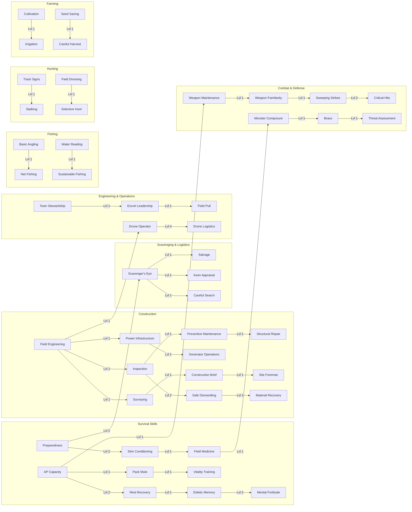

# Skill: [[Skills/index|Index]]

Skills are permanent character specializations that progress in real-time. Training a skill does not consume AP.

## 🔗 Skill Dependencies

```mermaid
graph LR
 subgraph general[Survival Skills]
  ap_capacity["AP Capacity"]
  rest_recovery["Rest Recovery"]
  preparedness["Preparedness"]
  inventory_capacity["Pack Mule"]
  mental_fortitude["Mental Fortitude"]
  stim_usage["Stim Conditioning"]
  field_medicine["Field Medicine"]
  vitality_training["Vitality Training"]
  eidetic_memory["Eidetic Memory"]
 end
 subgraph scavenging[Scavenging & Logistics]
  scavenger_eye["Scavenger's Eye"]
  salvage["Salvage"]
  keen_appraisal["Keen Appraisal"]
  careful_search["Careful Search"]
 end
 subgraph town_management[Engineering & Operations]
  field_pull["Field Pull"]
  town_stewardship["Town Stewardship"]
  escort_leadership["Escort Leadership"]
  drone_operator["Drone Operator"]
  drone_logistics["Drone Logistics"]
 end
 subgraph construction[Construction]
  construction_brief["Construction Brief"]
  field_engineering["Field Engineering"]
  generator_operations["Generator Operations"]
  power_infrastructure["Power Infrastructure"]
  inspection["Inspection"]
  structural_repair["Structural Repair"]
  safe_dismantling["Safe Dismantling"]
  surveying["Surveying"]
  site_foreman["Site Foreman"]
  preventive_maintenance["Preventive Maintenance"]
  material_recovery["Material Recovery"]
 end
 subgraph fighting[Combat & Defense]
  monster_composure["Monster Composure"]
  weapon_maintenance["Weapon Maintenance"]
  sweeping_strikes["Sweeping Strikes"]
  critical_hits["Critical Hits"]
  weapon_familiarity["Weapon Familiarity"]
  brace["Brace"]
  threat_assessment["Threat Assessment"]
 end
 subgraph fishing[Fishing]
  basic_angling["Basic Angling"]
  net_fishing["Net Fishing"]
  water_reading["Water Reading"]
  sustainable_fishing["Sustainable Fishing"]
 end
 subgraph hunting[Hunting]
  track_signs["Track Signs"]
  stalking["Stalking"]
  field_dressing["Field Dressing"]
  selective_hunt["Selective Hunt"]
 end
 subgraph farming[Farming]
  cultivation["Cultivation"]
  irrigation["Irrigation"]
  seed_saving["Seed Saving"]
  careful_harvest["Careful Harvest"]
 end

 ap_capacity -->|Lvl 2| rest_recovery
 preparedness -->|Lvl 2| scavenger_eye
 ap_capacity -->|Lvl 1| inventory_capacity
 escort_leadership -->|Lvl 1| field_pull
 surveying -->|Lvl 1| construction_brief
 eidetic_memory -->|Lvl 2| mental_fortitude
 town_stewardship -->|Lvl 1| escort_leadership
 power_infrastructure -->|Lvl 1| generator_operations
 preparedness -->|Lvl 2| stim_usage
 stim_usage -->|Lvl 1| field_medicine
 inventory_capacity -->|Lvl 1| vitality_training
 field_medicine -->|Lvl 1| monster_composure
 scavenger_eye -->|Lvl 1| salvage
 field_engineering -->|Lvl 1| drone_operator
 drone_operator -->|Lvl 4| drone_logistics
 field_engineering -->|Lvl 1| power_infrastructure
 ap_capacity -->|Lvl 1| weapon_maintenance
 weapon_familiarity -->|Lvl 1| sweeping_strikes
 sweeping_strikes -->|Lvl 2| critical_hits
 rest_recovery -->|Lvl 1| eidetic_memory
 weapon_maintenance -->|Lvl 1| weapon_familiarity
 monster_composure -->|Lvl 1| brace
 scavenger_eye -->|Lvl 1| keen_appraisal
 field_engineering -->|Lvl 1| inspection
 preventive_maintenance -->|Lvl 1| structural_repair
 inspection -->|Lvl 2| safe_dismantling
 brace -->|Lvl 1| threat_assessment
 scavenger_eye -->|Lvl 1| careful_search
 field_engineering -->|Lvl 1| surveying
 construction_brief -->|Lvl 1| site_foreman
 inspection -->|Lvl 1| preventive_maintenance
 safe_dismantling -->|Lvl 1| material_recovery
 cultivation -->|Lvl 1| irrigation
 seed_saving -->|Lvl 1| careful_harvest
 basic_angling -->|Lvl 1| net_fishing
 water_reading -->|Lvl 1| sustainable_fishing
 track_signs -->|Lvl 1| stalking
 field_dressing -->|Lvl 1| selective_hunt

 click ap_capacity "/Skills/ap_capacity"
 click rest_recovery "/Skills/rest_recovery"
 click preparedness "/Skills/preparedness"
 click scavenger_eye "/Skills/scavenger_eye"
 click inventory_capacity "/Skills/pack_mule"
 click field_pull "/Skills/field_pull"
 click construction_brief "/Skills/construction_brief"
 click mental_fortitude "/Skills/mental_fortitude"
 click field_engineering "/Skills/field_engineering"
 click town_stewardship "/Skills/town_stewardship"
 click escort_leadership "/Skills/escort_leadership"
 click generator_operations "/Skills/generator_operations"
 click stim_usage "/Skills/stim_conditioning"
 click field_medicine "/Skills/field_medicine"
 click vitality_training "/Skills/vitality_training"
 click monster_composure "/Skills/monster_composure"
 click salvage "/Skills/salvage"
 click drone_operator "/Skills/drone_operator"
 click drone_logistics "/Skills/drone_logistics"
 click power_infrastructure "/Skills/power_infrastructure"
 click weapon_maintenance "/Skills/weapon_maintenance"
 click sweeping_strikes "/Skills/sweeping_strikes"
 click critical_hits "/Skills/critical_hits"
 click eidetic_memory "/Skills/eidetic_memory"
 click weapon_familiarity "/Skills/weapon_familiarity"
 click brace "/Skills/brace"
 click keen_appraisal "/Skills/keen_appraisal"
 click inspection "/Skills/inspection"
 click basic_angling "/Skills/basic_angling"
 click track_signs "/Skills/track_signs"
 click cultivation "/Skills/cultivation"
 click structural_repair "/Skills/structural_repair"
 click safe_dismantling "/Skills/safe_dismantling"
 click threat_assessment "/Skills/threat_assessment"
 click careful_search "/Skills/careful_search"
 click surveying "/Skills/surveying"
 click site_foreman "/Skills/site_foreman"
 click preventive_maintenance "/Skills/preventive_maintenance"
 click material_recovery "/Skills/material_recovery"
 click irrigation "/Skills/irrigation"
 click seed_saving "/Skills/seed_saving"
 click careful_harvest "/Skills/careful_harvest"
 click net_fishing "/Skills/net_fishing"
 click water_reading "/Skills/water_reading"
 click sustainable_fishing "/Skills/sustainable_fishing"
 click stalking "/Skills/stalking"
 click field_dressing "/Skills/field_dressing"
 click selective_hunt "/Skills/selective_hunt"
```

## 🩸 Survival Skills
| Skill | Effect |
| :--- | :--- |
| **[[Skills/ap_capacity|AP Capacity]]** | +1 max Action Points per level. |
| **[[Skills/rest_recovery|Rest Recovery]]** | Gain a chance for +1 extra AP each rest period (per hour): 10% per level, up to 50%. |
| **[[Skills/preparedness|Preparedness]]** | Start each new run with increasingly useful field gear. |
| **[[Skills/pack_mule|Pack Mule]]** | +1 carried inventory slot per level (max +3). |
| **[[Skills/mental_fortitude|Mental Fortitude]]** | +1 max Fear capacity per level (max +3). |
| **[[Skills/stim_conditioning|Stim Conditioning]]** | Train your metabolism to use AP recovery stims. |
| **[[Skills/field_medicine|Field Medicine]]** | Learn proper wound care for medical supplies. |
| **[[Skills/vitality_training|Vitality Training]]** | +10 max Health per level (max +50). |
| **[[Skills/eidetic_memory|Eidetic Memory]]** | Remember the lay of the land. |

## 🔍 Scavenging & Logistics
| Skill | Effect |
| :--- | :--- |
| **[[Skills/scavenger_eye|Scavenger's Eye]]** | 5% higher chance to find loot when searching (per level). |
| **[[Skills/salvage|Salvage]]** | Learn to deconstruct items into base resources. |
| **[[Skills/keen_appraisal|Keen Appraisal]]** | Preview likely loot families on your current tile before searching. |
| **[[Skills/careful_search|Careful Search]]** | Optional slower searches that trade time for a better find chance. |

## 🏗️ Engineering & Operations
| Skill | Effect |
| :--- | :--- |
| **[[Skills/field_pull|Field Pull]]** | Requires Escort Leadership 1. |
| **[[Skills/town_stewardship|Town Stewardship]]** | Use the town resource tab responsibly. |
| **[[Skills/escort_leadership|Escort Leadership]]** | Lead an escort group and invite friends to follow you. |
| **[[Skills/drone_operator|Drone Operator]]** | Operate autonomous cargo drones safely. |
| **[[Skills/drone_logistics|Drone Logistics]]** | Tune cargo drone flight systems for faster deliveries. |

## 🔨 Construction
| Skill | Effect |
| :--- | :--- |
| **[[Skills/construction_brief|Construction Brief]]** | Pin one unfinished town construction (or a thin stock work order) to every survivor's HUD so the crew can focus deposits. |
| **[[Skills/field_engineering|Field Engineering]]** | Operate and calibrate advanced field facilities. |
| **[[Skills/generator_operations|Generator Operations]]** | Safely run and refuel the town generator. |
| **[[Skills/power_infrastructure|Power Infrastructure]]** | Install and recover field relay poles. |
| **[[Skills/inspection|Inspection]]** | Inspect field structures to view durability. |
| **[[Skills/structural_repair|Structural Repair]]** | Restore more durability when repairing field structures such as power poles. |
| **[[Skills/safe_dismantling|Safe Dismantling]]** | Improve the chance of recovering materials when dismantling eligible structures. |
| **[[Skills/surveying|Surveying]]** | Survey your current tile for power-pole placement constraints and a quick town-build readiness summary. |
| **[[Skills/site_foreman|Site Foreman]]** | Coordinate cooperative town builds. |
| **[[Skills/preventive_maintenance|Preventive Maintenance]]** | Maintain field structures so repairs are cheaper and siege damage is reduced on poles you service. |
| **[[Skills/material_recovery|Material Recovery]]** | When dismantling fails to recover the structure itself, salvage a capped share of scrap materials instead. |

## ⚔️ Combat & Defense
| Skill | Effect |
| :--- | :--- |
| **[[Skills/monster_composure|Monster Composure]]** | +1 monster-tile fear resistance per level (max +5). |
| **[[Skills/weapon_maintenance|Weapon Maintenance]]** | Reduce weapon break chance when attacking monsters by 2% per level (up to 10%). |
| **[[Skills/sweeping_strikes|Sweeping Strikes]]** | Each attack has a chance to kill 1 extra monster: 5% per level (up to 25%). |
| **[[Skills/critical_hits|Critical Hits]]** | Each attack has a chance to kill 2 extra monsters after dealing the weapon's normal damage: 2% per level (up to 10%). |
| **[[Skills/weapon_familiarity|Weapon Familiarity]]** | Improve minimum weapon damage against monsters by +1 per level (up to +3). |
| **[[Skills/brace|Brace]]** | Spend 1 AP to brace for the next monster retaliation, reducing damage taken by 10% per level (up to 30%). |
| **[[Skills/threat_assessment|Threat Assessment]]** | Preview expected monster retaliation and weapon break risk before you commit to an attack. |

## 🎣 Fishing
| Skill | Effect |
| :--- | :--- |
| **[[Skills/basic_angling|Basic Angling]]** | Improve shore fishing reliability. |
| **[[Skills/net_fishing|Net Fishing]]** | Cast a makeshift net from shore without a rod. |
| **[[Skills/water_reading|Water Reading]]** | Preview adjacent lake fish stocks before casting. |
| **[[Skills/sustainable_fishing|Sustainable Fishing]]** | Fish with less lasting depletion. |

## 🏹 Hunting
| Skill | Effect |
| :--- | :--- |
| **[[Skills/track_signs|Track Signs]]** | Read forest sign to improve hunting success. |
| **[[Skills/stalking|Stalking]]** | Spend 1 AP to prepare on a forest tile, then take a bonus to your next hunt there before midnight. |
| **[[Skills/field_dressing|Field Dressing]]** | When a hunt succeeds, chance to recover Hide Scrap for crafting in addition to meat. |
| **[[Skills/selective_hunt|Selective Hunt]]** | Choose a light take that sometimes leaves local game in place. |

## 🌾 Farming
| Skill | Effect |
| :--- | :--- |
| **[[Skills/cultivation|Cultivation]]** | Tend public farmland crops. |
| **[[Skills/irrigation|Irrigation]]** | Water crops more effectively so they ripen sooner. |
| **[[Skills/seed_saving|Seed Saving]]** | Chance to recover a Mutant Seed Pod when harvesting ripe crops. |
| **[[Skills/careful_harvest|Careful Harvest]]** | Improve usable yield when harvesting. |

## ⏳ Training Times
Training times are fixed real-world intervals.
- **Level 1**: 1 Hour
- **Level 2**: 24 Hours
- **Level 3**: 7 Days
- **Level 4**: 14 Days
- **Level 5**: 30 Days
