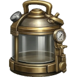
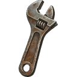

# Biome: [[biomes/industrial|Industrial Zone]]

![[assets/tiles/industrial_01.png|250]]

**Description**: A manufacturing and processing complex.

## Strategic Importance
- Primary source for ** [[items/chemical_sludge|Chemical Sludge]]** (Weight 70) and ** [[items/scrap_metal|Scrap Metal]]** (Weight 60).
- High concentration of ** [[items/copper_wiring|Copper Wiring]]** (Weight 45) and ** [[items/empty_canister|Empty Canister]]** (Weight 45).
- Good source for ** [[items/gasoline_canister|Gasoline Canister]]** (Weight 30) and ** [[items/battery|Battery]]** (Weight 30).

## Loot Tables (Absolute % Chance)
| Item | % Per Hour |
| :--- | :--- |
| ** [[items/chemical_sludge|Chemical Sludge]]** | 6.4% |
| ** [[items/scrap_metal|Scrap Metal]]** | 6.0% |
| ** [[items/copper_wiring|Copper Wiring]]** | 4.5% |
| ** [[items/empty_canister|Empty Canister]]** | 4.5% |
| ** [[items/lamp_empty|Lamp (empty)]]** | 4.0% |
| ** [[items/old_glass_bottle|Old Glass Bottle]]** | 4.0% |
| ** [[items/burnt_motor|Burnt-Out Motor]]** | 4.0% |
| ** [[items/car_battery|Car Battery]]** | 3.5% |
| ** [[items/cracked_lens|Cracked Lens]]** | 3.5% |
| ** [[items/ruined_generator_parts|Ruined Generator Parts]]** | 3.5% |
| ** [[items/battery|Battery]]** | 3.0% |
| ** [[items/broken_radio|Broken Radio]]** | 3.0% |
| ** [[items/gasoline_canister|Gasoline Canister]]** | 2.7% |
| ** [[items/stone|Hardened Stone]]** | 2.5% |
| ** [[items/rusty_tool|Rusty Tool]]** | 2.5% |
| ** [[items/gasoline_generator_empty|Gasoline Generator (empty)]]** | 2.0% |
| ** [[items/malfunctioning_sensor|Malfunctioning Sensor]]** | 1.8% |
| ** [[items/research_material|Research Material]]** | 1.6% |
| ** [[items/broken_binoculars|Broken Binoculars]]** | 1.5% |
| ** [[items/biofuel_cell|Biofuel Cell]]** | 1.5% |
| ** [[items/glowing_mushroom|Glowing Mushroom]]** | 1.4% |
| ** [[items/damaged_solar_panel|Damaged Solar Panel]]** | 1.4% |
| ** [[items/circuit_boards|Circuit Boards]]** | 1.1% |
| ** [[items/gasoline_generator|Gasoline Generator]]** | 1.1% |
| ** [[items/stim_pack|Stim Pack]]** | 1.0% |
| ** [[items/stim_injector|Stim Injector]]** | 0.9% |
| ** [[items/rations|Rations]]** | 0.6% |
| ** [[items/water|Clean Water]]** | 0.5% |
| ** [[items/timber|Raw Timber]]** | 0.5% |
| ** [[items/stim_overdrive|Stim Overdrive]]** | 0.1% |
| ** [[items/salad|Salad]]** | 0.1% |

## Technical Information
- **Asset ID**: `industrial`
- **Asset Path**: `tiles/industrial_01.png`
