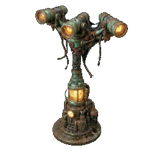
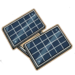

# Copper Wiring

![[assets/items/copper_wiring.png|150]]

### Core Properties
- **Rarity**: common
- **Category**: Material
- **Description**: Electrical wiring for connecting solar panels to the grid.

## Usage
- Building [[base/upgrades|Battery Storage]]
- Building [[base/upgrades|Beacon Amplifier]]
- Building [[base/upgrades|Solar Panels]]
- Crafting  [[items/power_pole|Power Pole]]
- Crafting  [[items/solar_cell|Solar Cell]]

## Obtained From Deconstruction
> **Note**: Retrieval chance is affected by the source item's yield probability and your **[[skills/salvage|Salvage]]** skill level.

- From  [[items/solar_cell|Solar Cell]]: **50%** base chance.
- From  [[items/power_pole|Power Pole]]: **50%** base chance.
- From  [[items/damaged_solar_panel|Damaged Solar Panel]]: **50%** base chance.
- From  [[items/burnt_motor|Burnt-Out Motor]]: **40%** base chance.
- From  [[items/gasoline_generator|Gasoline Generator]]: **30%** base chance.
- From  [[items/broken_radio|Broken Radio]]: **30%** base chance.
- From  [[items/ruined_generator_parts|Ruined Generator Parts]]: **30%** base chance.
- From  [[items/lamp_empty|Lamp (empty)]]: **20%** base chance.
- From  [[items/lamp_functioning|Functioning Lamp]]: **5%** base chance (Rare Bonus).

## Biome Probabilities (Absolute %)
| Biome | % Per Hour |
| :--- | :--- |
| [[biomes/electronic_lab|Electronic Store - Lab]] | 5.5% |
| [[biomes/industrial|Industrial Zone]] | 4.5% |
| [[biomes/farm_facility|Human Human Farm Facility]] | 4.3% |
| [[biomes/hidden_vault|Hidden Vault]] | 4.1% |
| [[biomes/ruined_city|Ruined City]] | 3.8% |
| [[biomes/mountain|Mountain - Quarry]] | 3.3% |
| [[biomes/desert|Desert - Sand]] | 1.6% |
| [[biomes/forest|Forest]] | 1.2% |

## Technical Information
- **Asset ID**: `copper_wiring`
- **Asset Path**: `items/copper_wiring.png`