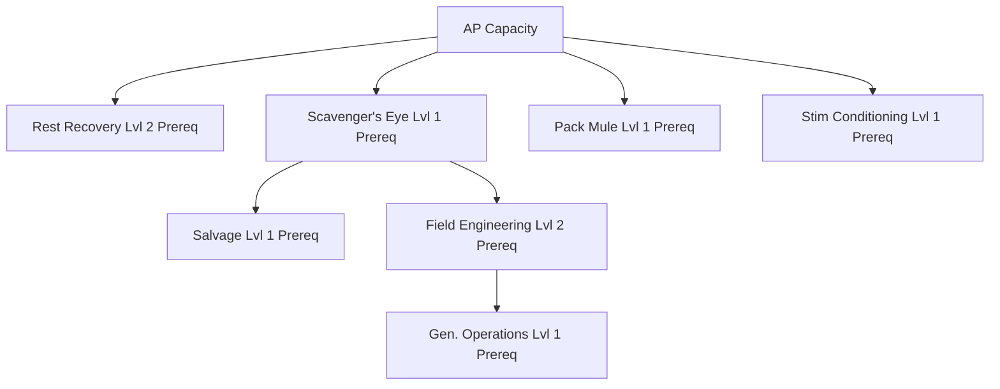

# Mechanism: [[mechanisms/skills|Skills]] and Specialization

## Core Skills

| Skill | Max Lvl | Description | Effect |
| :--- | :--- | :--- | :--- |
| **AP Capacity** | 5 | Increases maximum Action Points. | +1 Max AP per level. |
| **Rest Recovery** | 5 | Chance for extra AP each rest period. | +10% chance per level (Max 50%). |
| **Scavenger's Eye** | 5 | Improved searching capabilities. | +5% search success chance per level. |
| **Pack Mule** | 3 | Increases carried inventory slots. | +1 slot per level (Max +3). |
| **Salvage** | 5 | Deconstruct items into resources. | Lvl 1: Unlock. +10% yield, +5% rare chance/lvl. |
| **Field Engineering**| 3 | Operate advanced field facilities. | Required for Industrial/Electronic Labs. |
| **Gen. Operations** | 3 | Run and refuel town generators. | Unlocks higher tier fuels. |
| **Stim Conditioning**| 3 | Train metabolism for AP stims. | Unlocks Common (Lvl 1), Rare (2), Mythic (3). |

## Progression & Prerequisites

The skill tree is designed to encourage cooperation through specialized roles.

### Training Times
Training is a real-time process requiring significant dedication for higher levels.
- **Level 1**: 1 Hour
- **Level 2**: 24 Hours (1 Day)
- **Level 3**: 7 Days
- **Level 4**: 14 Days
- **Level 5**: 30 Days

## Specialist Roles (Inferred)
- **The Scout**: Focuses on **AP Capacity** and **Scavenger's Eye** to map the world.
- **The Quartermaster**: Focuses on **Pack Mule** and **Salvage** to manage resources.
- **The Engineer**: Focuses on **Field Engineering** and **Generator Operations**.
- **The Survivor**: Focuses on **Rest Recovery** and **Stim Conditioning**.
