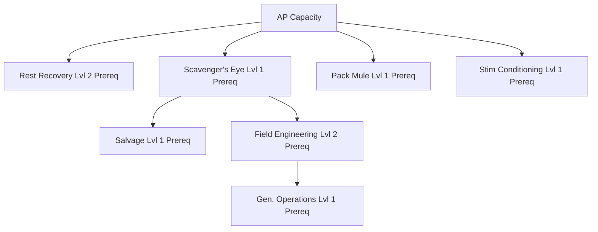

# Mechanism: [[mechanisms/skills|Skills]] and Specialization

## Core Skills

| Skill | Max Lvl | Description | Effect |
| :--- | :--- | :--- | :--- |
| **AP Capacity** | 5 | +1 max Action Points per level. Permanent character upgrade. | +1 Max AP per level. |
| **Rest Recovery** | 5 | Gain a chance for +1 extra AP each rest period (per hour): 10% per level, up to 50%. | +10% chance per level (Max 50%). |
| **Scavenger's Eye** | 5 | 5% higher chance to find loot when searching (per level). Does not auto-find; improves roll vs encounter. | +5% search success chance per level. |
| **Pack Mule** | 3 | +1 carried inventory slot per level (max +3). 1 item always = 1 slot. | +1 slot per level (Max +3). |
| **Salvage** | 5 | Learn to deconstruct items into base resources. Level 1 unlocks deconstruction. Higher levels improve base yield (+10% per level) and increase chance for rare bonus materials (+5% per level). | Lvl 1: Unlock. +10% yield, +5% rare chance/lvl. |
| **Field Engineering**| 3 | Operate and calibrate advanced field facilities. Required to set production in Industrial and Electronic Lab tiles. | Required for Industrial/Electronic Labs. |
| **Gen. Operations** | 3 | Safely run and refuel the town generator. Higher levels are required for advanced fuel types. | Unlocks higher tier fuels. |
| **Stim Conditioning**| 3 | Train your metabolism to use AP recovery stims. Level 1/2/3 unlocks common/rare/mythic stims. | Unlocks Common (Lvl 1), Rare (2), Mythic (3). |

## Progression & Prerequisites

The skill tree is designed to encourage cooperation through specialized roles.

### Training Times
Training is a real-time process requiring significant dedication for higher levels.
- **Level 1**: 1 Hour (3,600,000 ms)
- **Level 2**: 24 Hours (86,400,000 ms)
- **Level 3**: 7 Days (604,800,000 ms)
- **Level 4**: 14 Days (1,209,600,000 ms)
- **Level 5**: 30 Days (2,592,000,000 ms)

## Specialist Roles (Inferred)
- **The Scout**: Focuses on **AP Capacity** and **Scavenger's Eye** to map the world.
- **The Quartermaster**: Focuses on **Pack Mule** and **Salvage** to manage resources.
- **The Engineer**: Focuses on **Field Engineering** and **Generator Operations**.
- **The Survivor**: Focuses on **Rest Recovery** and **Stim Conditioning**.
