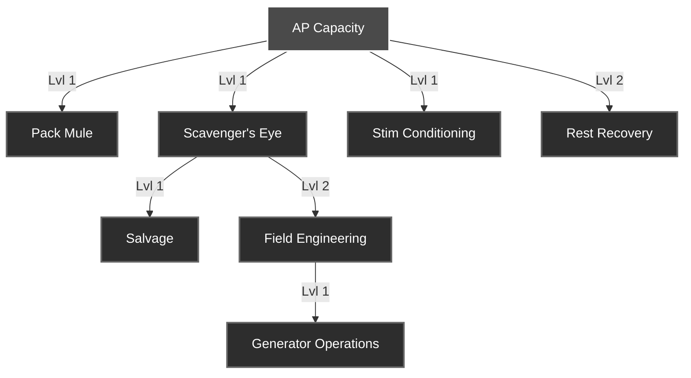

# Hex Survival Skills

Skills represent your survivor's long-term specialization. Training takes real-time and persists between town instances.

## Skill Progression
Training costs **0 AP** but requires significant actual time to complete.

| Level | Duration |
| :--- | :--- |
| **Level 1** | 1 Hour |
| **Level 2** | 24 Hours (1 Day) |
| **Level 3** | 7 Days |
| **Level 4** | 14 Days |
| **Level 5** | 30 Days |

## Dependency Tree

## Skill Directory

### [[skills/ap_capacity|AP Capacity]]
Increases your maximum Action Point pool.

### [[skills/rest_recovery|Rest Recovery]]
Provides a chance for bonus AP while resting.

### [[skills/scavenger_eye|Scavenger's Eye]]
Increases the hourly success rate of scavenging.

### [[skills/pack_mule|Pack Mule]]
Expands your personal inventory capacity.

### [[skills/field_engineering|Field Engineering]]
Unlocks production in industrial facilities.

### [[skills/generator_operations|Generator Operations]]
Required for refueling town power generators.

### [[skills/stim_conditioning|Stim Conditioning]]
Allows the safe use of high-tier stimulants.

### [[skills/salvage|Salvage]]
Unlocks the ability to deconstruct items for materials.
